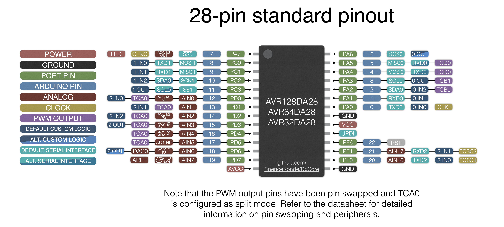

# AVR128DA28/AVR64DA28/AVR32DA28
## Pin Mapping / Pinout


## Features and Peripherals
| -                                | AVR32DA28       | AVR64DA28       | AVR128DA28      |
|----------------------------------|-----------------|-----------------|-----------------|
| Flash Memory                     | 32768           | 65536           | 131072          |
| Flash Memory (With Optiboot)     | 32256           | 65024           | 130560          |
| SRAM                             | 4096            | 8192            | 16384           |
| EEPROM                           | 512             | 512             | 512             |
| User Row                         | 32              | 32              | 32              |
| Max. Frequency (rated, MHz)      | 24              | 24              | 24              |
| Clock Sources                    | INT, EXT        | INT, EXT        | INT, EXT        |
| Packages Available               | SOIC, SSOP, DIP | SOIC, SSOP, DIP | SOIC, SSOP, DIP |
| Total pins on package            | 28              | 28              | 28              |
| I/O Pins (not reset/UPDI)        | 22              | 22              | 22              |
| Fully async pins                 | 6               | 6               | 6               |
| UPDI as I/O Pin                  | No              | No              | No              |
| PWM capable I/O pins             | 20              | 20              | 20              |
| Max simultaneous PWM outputs     | 11: 6+2+3       | 11: 6+2+3       | 11: 6+2+3       |
| 16-bit Type A Timers - pins ea   | 1: 18           | 1  18           | 1: 18           |
| 16-bit Type B Timers, (pins)     | 3: 3            | 3: 3            | 3: 3            |
| 12-bit Type D pins               | 4 ~6~           | 4 ~6~           | 4 ~6~           |
| USART (pin mappings)             | 3: 2/1/1        | 3: 2/1/2        | 3: 2/1/1        |
| SPI (pin mappings)               | 2: 1/1          | 2: 1/1          | 2: 1/1          |
| TWI/I2C (pin mappings)           | 1: 2            | 1: 2            | 1: 2            |
| 12-bit ADC input pins            | 10              | 10              | 10              |
| Of those, neg. diff. inputs      | 8               | 8               | 8               |
| 10-bit DAC                       | 1               | 1               | 1               |
| Analog Comparator (AC)           | 3               | 3               | 3               |
| Zero-Cross Detectors (ZCD)       | 1               | 1               | 1               |
| Custom Logic Blocks (LUTs)       | 4               | 4               | 4               |
| Event System channels (out pins) | 8: 7            | 8: 7            | 8: 7            |
| On-chip opamps (OPAMP)           | -               | -               | -               |
| MVIO, pins                       | Yes, 4          | Yes, 4          | Yes, 4          |
| Flash Endurance                  | 1k ~10k~        | 1k ~10k~        | 1k ~10k~        |
| LED_BUILTIN (and optiboot led)   | PIN_PA7         | PIN_PA7         | PIN_PA7         |

## DA28 - the baseline 32-pin Dx-series part
This is a DA32 - without the last 4 pins of PORTF. This is more of a blow than you would expect, because it costs us the only pins for the TWI1, a USART mapping, and a very good TCA mapping. The DA/DB-series parts kinda fall flat when they get down to 28 pins.

### Fully async pins
Pins 2 and 6 within each port are "fully async" and can respond to events shorter than 1 clock cycle, and can wake the pin on RISING or FALLING edges, not just LOW_LEVEL and CHANGE.

### USART0 mux options
| All     |  TX |  RX | XDIR | XCK |
|---------|-----|-----|------|-----|
| DEFAULT | PA0 | PA1 |  PA2 | PA3 |
| ALT1    | PA4 | PA5 |  PA6 | PA7 |
| NONE    |  -  |  -  |   -  |  -  |

### Other USARTs
They don't get any mux options.
| All     |  TX |  RX | XDIR | XCK |
|---------|-----|-----|------|-----|
| USART1  | PC0 | PC1 |  PC2 | PC3 |
| USART2  | PF0 | PF1 |   -  |  -  |

### SPI  mux options
| SPI          | Swap name  | MOSI | MISO | SCK |  SS |
|--------------|------------|------|------|-----|-----|
| SPI0 DEFAULT | SPI0_SWAP0 |  PA4 |  PA5 | PA6 | PA7 |
| SPI1 DEFAULT | SPI1_SWAP0 |  PC0 |  PC1 | PC2 | PC3 |

The SPI library only makes one SPIClass object available (see [The SPI.h library documentation](../libraries/SPI/README.md) for details).

### TWI0 mux options
| Mapping | swap | Master or Slave | Dual Mode Slave |
|---------|------|-----------------|-----------------|
| DEFAULT | 0    | SDA/PA2 SCL/PA3 | SDA/PC2 SCL/PC3 |
| ~ALT1~  | ~1~  | ~SDA/PA2 SCL/PA3~ | ~Not avail.~  |
| ALT2    | 2    | SDA/PC2 SCL/PC3 | Not avail.      |

Note that this means that you want Wire.swap(0, 2, but not 1).

### PWM Pins
* TCA0 is by default set to PORTD - PORTA is too crowded, PORTC is not complete.
* TCD0 is left at the default pins on PORTA, because they are the only ones that work.
* The 3 type B timers are set for PA2, PA3, and PC0, and this cannot be changed at runtime. Note that the millis timer cannot be used to generate PWM. TCB2 is the default millis timer, though this can be changed from the tools menu.
* This gives 6 + 2 + 3 = 11 PWM channels simultaneously outputting PWM, more than half of the total on the part!

#### TCA mux options
The Type A timers (TCA0 and TCA1) can be mapped to different pins as a group only, and analogWrite() is PORTMUX-aware - you can set TCA0 to output on any port's pin 0-5, and TCA1 to PORTB. Using this feature is easy - but not quite as trivial as other parts, since there are two bitfields. You simply write to the portmux register `PORTMUX.TCAROUTEA =S (TCA0 pinset)` and then analogWrite() normally. TCA0 pinset is the port number (0-5 for ports A-F).

| TCA0    | WO0 | WO1 | WO2 | WO3 | WO4 | WO5 |
|---------|-----|-----|-----|-----|-----|-----|
| PORTA   | PA0 | PA1 | PA2 | PA3 | PA4 | PA5 |
| PORTC   | PC0 | PC1 | PC2 | PC3 |  -  |  -  |
| **PORTD** | PD0 | PD1 | PD2 | PD3 | PD4 | PD5 |
| PORTF   | PF0 | PF1 |  -  |  -  |  -  |  -  |


It is strongly recommended to not have any PWM output enabled involving either the timer being moved nor the pins it is being moved to when setting `PORTMUX.TCAROUTEA`. In the latter case, you will not be able to turn off the existing PWM through the API functions.
```c
PORTMUX.TCAROUTEA = PORTMUX_TCA0_PORTA_gc // PWM on PORTA
// Note since there is only one TCA, you can use simple assignment to write values to PORTMUX.TCAROUTEA to.
```

#### TCB mux options
| TCBn | Default |  Alt  |
|------|---------|-------|
| TCB0 | **PA2** |   -   |
| TCB1 | **PA3** |   -   |
| TCB2 | **PC0** |   -   |

There are no type B timer remapping options.
The type B timers are much better utility timers than PWM timers. TCB2 is the default millis timer and cannot be used for PWM in that mode.

#### TCD0 mux options
| TCD0    | WOA | WOB | WOC | WOD |
|---------|-----|-----|-----|-----|
| DEFAULT | PA4 | PA5 | PA6 | PA7 |
| ALT2    | ~PF0~ | ~PF1~ | - | - |

The Type D timer, TCD0, has 2 output channels (WOA and WOB) and 4 output pins (WOA, WOB, WOC, and WOD). The hardware permits WOC and WOD to each output either WOA or WOB, but this added too much complexity to analogWrite; WOA and WOC output WOA, and WOD and WOB output WOB. Calling analogWrite() on either pin will enable it, calling digitalWrite() on that pin will turn the PWM off. Calling analogWrite() on WOC while already outputting on the WOA pin will result in both pins outputting the new duty cycle. Call digital write on first pin if this is not what you want. The datasheet describes TCD0 output on PA4-7, PB4-7, PF0-3, and PG4-7. What the datasheet giveth, the errata taketh away: the alternate pin options are hopelessly broken currently, only PA4-7 work.

### LED_BUILTIN
Following precedent set by MegaCoreX, we declare that pin 7 - `PIN_PA7` shall be the pin that the core "expects" to be connected to an LED. LED_BUILTIN is defined as that pin, and the bootloader will set that pin as output and try to blink the LED. Note that if the bootloader is not used, and your sketch does not reference `LED_BUILTIN` this pin is not otherwise treated any differently. This can be overridden if a custom board definition is created by passing `-DLED_BUILTIN = (some other pin)` in the `build.extra_flags` field.

### Reset pin can be input
Reset (PF6) can be set to work as an input (but never an output). The UPDI pin cannot be configured as an I/O pin.

### ADC pins in differential mode
Only pins on PORTD and PORTE can be used as the negative side of a differential analog reading (`analogReadDiff()`). Pins on PORTF can be used as positive or single ended ADC inputs only.

## Errata and Datasheets
Get the most up to date information from Microchip's website. They keep moving files around, so I'm just going to link their product pages. There is no difference in the datasheets for the different flash sizes. The errata, however, is drastically different. This is partly due to the errata being incomplete, but also due to the fact that the 128k size was released first, several bugs were fixed, and then the smaller flash sizes were released.
[AVR DA-series](https://www.microchip.com/en-us/products/microcontrollers-and-microprocessors/8-bit-mcus/avr-mcus/avr-da)
