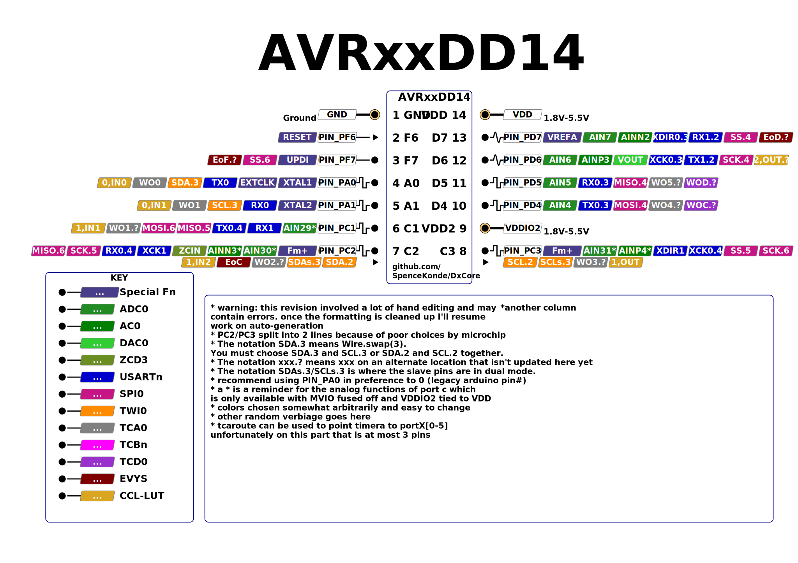

# AVR64DD14/AVR32DD14/AVR16DD14

## Pin Mapping / Pinout


## Features and Peripherals
| Feature                        | AVR16DD14       | AVR32DD14       | AVR64DD14       |
|--------------------------------|-----------------|-----------------|-----------------|
| Flash Memory                   | 16384           | 32768           | 65536           |
| Flash Memory (with Optiboot)   | 15872           | 32256           | 65024           |
| SRAM                           | 2048            | 4096            | 8192            |
| EEPROM                         | 256             | 256             | 256             |
| User Row                       | 32              | 32              | 32              |
| Max. Frequency (rated, MHz)    | 24              | 24              | 24              |
| Clock Sources                  | INT, EXT, XTAL  | INT, EXT, XTAL  | INT, EXT, XTAL  |
| Packages Available             | SOIC            | SOIC            | SOIC            |
| Total pins on package          | 14              | 14              | 14              |
| I/O Pins (not reset/UPDI)      | 9               | 9               | 9               |
| Fully async pins               | 11              | 11              | 11              |
| UPDI as I/O Pin                | Yes             | Yes             | Yes             |
| PWM capable I/O pins           | 7               | 7               | 7               |
| Max simultaneous PWM outputs   | 5: 3+2          | 5: 3+2          | 5: 3+2          |
| 16-bit Type A Timers - pins ea | 1: 2/3/2        | 1: 2/3/2        | 1: 2/3/2        |
| 16-bit Type B Timers, (pins)   | 2: 0            | 2: 0            | 2: 0            |
| 12-bit Type D pins             | 2               | 2               | 2               |
| USART (pin mappings)           | 2: 3/1          | 2: 3/1          | 2: 3/1          |
| SPI (pin mappings)             | 1: 2            | 1: 2            | 1: 2            |
| TWI/I2C (pin mappings)         | 1: 2            | 1: 2            | 1: 2            |
| 12-bit ADC input pins          | 4/7             | 4/7             | 4/7             |
| Of those, neg. diff. inputs    | all             | all             | all             |
| 10-bit DAC                     | 1               | 1               | 1               |
| Analog Comparator (AC)         | 1               | 1               | 1               |
| Zero-Cross Detectors (ZCD)     | 1               | 1               | 1               |
| Custom Logic Blocks (LUTs)     | 4               | 4               | 4               |
| Event System channels (out pins)| 6: 3           | 6: 3            | 6: 3            |
| On-chip opamps (OPAMP)         | -               | -               | -               |
| MVIO, pins                     | Yes, 3          | Yes, 3          | Yes, 3          |
| Flash Endurance                | 1k              | 1k              | 1k              |
| LED_BUILTIN (and optiboot led) | PIN_PD6 or PD4  | PIN_PD6 or PD4  | PIN_PD4 or PD6  |

## AVR DD14 - DD-tier peripherals in a tinyAVR size package
The DD-series parts are low-cost, low-pincount AVRs with MVIO and all the headline features of the DB except for the opamps and the sheer number of peripherals. To make the most of the small pincount, these have significantly expanded mapping options for USART0, USART1, SPI0, and TWI0.

### Fully async pins
All pins on the DDs are supposedly fully async, instead of just pins 2 and 6 within each port. Whether this is actually a good thing or not can be debated.

### USART mux options

| USART0: | swap |  TX |  RX | XDIR | XCK |
|---------|------|-----|-----|------|-----|
| DEFAULT | 0    | PA0 | PA1 |   -  |  -  |
| ALT3    | 3    | PD4 | PD5 |  PD6 | PD7 |
| ALT4    | 4    | PC1 | PC2 |  PC3 |  -  |

| USART1  | swap |  TX |  RX | XDIR | XCK |
|---------|------|-----|-----|------|-----|
| ~DEFAULT~ | ~0~ | ~-~ | ~PC1~ | ~PC2~ | ~PC3~ |
| ALT2    | 2    | PD6 | PD7 |   -  |  -  |
DEFAULT is not terribly useful here, though implemented in the hardware. We don't have a graceful way to propagate the swap level when creating the USART objects though, and arguments against changing PORTMUX options willy-nilly have some weight. Just call swap(2).

### SPI0 mux options
| SPI0    | swap | MOSI | MISO | SCK |  SS |
|---------|------|------|------|-----|-----|
| ALT4    | 4    |  PD4 |  PD5 | PD6 | PD7 |
| ~ALT5~  | ~5~  |  ~-~ | ~PC1~ | ~PC2~ | ~PC3~ |
| ALT6    | 6    |  PC1 |  PC2 | PC3 | PF7 |

ALT5 is not the most useful multiplexing option, and should probably not be used - ALT6 however gives you SPI on the right pins of PORTC to be useful for MVIO, while ALT4 (the default) gives you non-MVIO-referenced SPI levels.

### TWI0 mux options
| Mapping | swap | Master or Slave | Dual Mode Slave |
|---------|------|-----------------|-----------------|
| ~DEFAULT~ | ~0~ | ~Not avail.~ | ~SDA/PC2 SCL/PC3~ |
| ALT2    | 2    | SDA/PC2 SCL/PC3 | Not avail.      |
| ALT3    | 3    | SDA/PA0 SCL/PA1 | SDA/PC2 SCL/PC3 |

Note that this means that you want Wire.swap(2, or 3, but not 0 or 1). While swap level 0 is "implemented" in hardware it is not useful - you can do everything you could with swap 0 using swap 2 or swap3 3 and then some - and with binary size smaller than or equal to what can be achieved with swap 0. None of the pins used by swap 1 exist at all.

### PWM Pins
With 14 pins, there isn't a whole lot of choice...
* TCA0 obviously wants to be on PORTC. On PORTD it would be fully redundant with the TCD, and PA0 and PA1 are the pins used for external clock sources.
* TCD0 only has pins on PORTD, so we set that by default
* The TCBs don't get used for PWM. They support no pins present.

#### TCA0 mux options
The Type A timers (TCA0) can be mapped to different pins as a group only, and analogWrite() is PORTMUX-aware - you can set TCA0 to output on any port's pin 0-5. Using this feature is easy - you simply write to the portmux register `PORTMUX.TCAROUTEA = (TCA0 pinset)` and then analogWrite() normally. TCA0 pinset is the port number (0-5 for ports A-F).

| TCA0    | WO0 | WO1 | WO2 | WO3 | WO4 | WO5 |
|---------|-----|-----|-----|-----|-----|-----|
| PORTA   | PA0 | PA1 |  -  |  -  |  -  |  -  |
| PORTC   |  -  | PC1 | PC2 | PC3 |  -  |  -  |
| PORTD   |  -  | -   |  -  |   - | PD4 | PD5 |

Yeah - for a timer with 6 PWM outputs, these pin mapping options are pretty bleak.

It is strongly recommended to not have any PWM output enabled involving either the timer being moved nor the pins it is being moved to when setting `PORTMUX.TCAROUTEA`. In the latter case, you will not be able to turn off the existing PWM through the API functions.
```c
PORTMUX.TCAROUTEA = PORTMUX_TCA0_PORTF_gc | PORTMUX_TCA1_PORTB_gc; // PWM on PORTF and PORTB pins 0-5
PORTMUX.TCAROUTEA = (PORTMUX.TCAROUTEA & PORTMUX_TCA1_gm) | PORTMUX_TCA0_PORTD_gc; // Move TCA0 PWM to PORTD but don't change TCA0
// The first option is slightly faster, as it isn't a read-modify-write.
// Note that PORTMUX_TCA0_PORTA_gc and PORTMUX_TCA1_PORTB_gc have a numeric value of 0.
```

#### TCB mux options
No TCB output pin exists as a physical pin on the DD14s

#### TCD0 mux option
| TCD0    | WOA | WOB | WOC | WOD |
|---------|-----|-----|-----|-----|
| Alt4    |  -  |  -  | PD4 | PD5 |

Only one set of pins actually exists. Default is not a valid option here as it has no pins, core defaults to ALT4, the only one with pins.

### LED_BUILTIN
It is not possible to match other parts; `PIN_PA7` does not exist here. We also don't want to use PA0 or PA1 (because then they would conflict with a crystal, and crystals can be damaged by such abuse). It shouldn't be an MVIO pin, because there are no safe choices. If you want serial to go to a different-voltage device, you NEED PC1 and PC2 free. If you want I2C, you NEED PC2 and PC3. And you need all three for SPI. So PORTC is out of the running, leaving only PD4, PD5, PD6 and PD7 - and either PD4 and PD5 or PD6 and PD7 are may be used to talk to the bootloader, PF6 is reset and has no output drivers, and PF7 is UPDI and reconfiguring it will brick it if you don't have an HV programmer. So that leaves us with... uhhh.... Hmm, let's go over that again....

```text
~PF6~                     <- Typically reset, and in any case doesn't have output drivers at all.
~PF7~                     <- UPDI, cannot be used as I/O pin without disabling UPDI. UPDI will not function with an LED on the same pin, so LED would also need to be connected afterwards.
~PA0~ ~PA1~               <- Crystal pins, need to avoid so we don't damage any crystal installed. These pins are also highly sought after - they have practically every peripheral available on them. Crystal (32 kHz or high speed), TCA0 PWM, SPI ALT3, TWI0, and both are also inputs for CCL0 (the 14-pin parts have input pins present for only 2 of their CCL logic blocks - and only 2 out of the three inputs.
~PC1~ ~PC2~ ~PC3~         <- MVIO pins, might not be powered, more likely to interfere with operation in multi-voltage scenarios.
~PD4~ ~PD5~ ~PD6~ ~PD7~   <- might be used for Serial communication with bootloader.
```

The quartet of pins on PD are the best candidates. These can be split into two pairs for consideration, and seen that way there are two decisions that need to be made:
* Does one pick the higher (PD6, PD7) or lower (PD4, 5) pair? This depends on the serial port used, obviously - if USART1 is used, it can only use PD6 and PD7 for TX and RX, so the LED then has to go on PD4 or PD5; if USART0 is used, there are 3 pinsets possible, one of which implies that the LED must be on PD6 or PD7, while the other two do not impose specific constraints. So this question is trivially answered for 2 of the 4 bootloader pinset choices, and we know that those two should have the same pinout, as the alternative would be more confusion that is necessary.
* Within each pair, is the lower or upper pin a better LED pin? The pins may at first appear to be of equal value. But this is not the case. The communication methods we are concerned with here are SPI and Serial. In the case of Serial, the even pin is TX, the odd pin RX. While for SPI, even pins are MOSI and SCK for even pins, or MISO or SS for odd ones.

Let's consider these uses of the pin, and what would happen if an LED was connected to the pin as well.
  * **SS** - this pin is not used as an SPI pin through the Arduino SPI.h library. I am aware of no library that implements SPI slave (there are some awkward things about an SPI slave that make it more difficult to use than TWI slave, or a UART peer, while being very easy to use as a master. Chief among those concerns for Arduino is the expectation by masters that SPI respond fast. There is no mechanism for the slave to make the master slow down or wait until data can be prepared. Unlike UART, which is fully asynchronous and has no limit unless the programmer of the other device implements one, TWI/I2C where the slave can hold the clock line because the bus is open drain, neither of those are possible in the case of SPI. Making matters worse, SPI is generally run at much higher data rates than I2C or serial, which makes SPI slave less feasible and the SS pin less relevant). The point is, the fact that PD7 is the SPI SS pin doesn't really matter, as Arduino applications typically have SPI in master mode with the SS pin disabled (certainly that's how the SPI.h library configures it).
  * **TX, MOSI, SCK** All of these have in common that they are typically controlled by the AVR. This is of course not always true - a USART can be used in open drain mode, or an SPI device can be a slave rather than a master (as discussed above, the SPI case is unlikely). With the exception of USART in open drain, single wire mode, these all involve the AVR driving the pin as an output, and unlike TWI, the maximum current is not throttled. These alternate functions will thus not be problematic if a LED is also connected, provided one has picked a reasonable series resistor. Imagine a 1k ohm resistor - across a LED with 1.8V forward voltage and a 1k resistor, you would have just over 3 volts across the resistor, hence just over 3 mA of current. It is easy to demonstrate that for virtually any LED of modern manufacture, being used for a purpose other than general illumination or similar high power application, that 1mA will be plenty bright enough.
  * **MISO** In this case, the pin is driven by the other device. Some parts have pin drivers as strong as an AVR. Many do not, however. That, in turn, raises the possibility that the LED could keep the other device from being able to drive the pin high, and interfere with a signal (though the INLVL bit could be set for the pin to lower the threshold for the pin to treat an input as a 1). Slave devices that are compliant with the SPI spec will tolerate the pin being arbitrarily driven high or low as long as their SS pin is not driven low. So that makes PD5 the worst of the four.
  * **RX** This has the same concern as MISO - only more so, because serial devices sometimes have a resistor in series with them. To put another mark against using an alternate RX pin to drive the Optiboot LED, while SPI devices expect to be on a bus, with other devices using the same MISO line... this is *not* true of a typical UART connection, where the two devices are wired only to each other. The devices will thus typically have a push-pull driver, and be able to drive the pin either high or low. So toggling the pin (or rather, attempting to) while another serial device was connected would have a good chance of damaging the other device, in addition to the impediment that said LED would pose to receiving a signal. These two issues are essentially opposites - one expects that the TX pin of the other device (which we'd connect to RX) to either have low impedance (so that if the two devices try to drive the pin in opposite directions, the "loser" might be damaged) or they are higher impedance, and a milliamp or few driving a LED would drag down the output enough to not be clearly detected. In the latter case, INLVL would help - TTL level would likely be good enough that the forward voltage of the LED made incoming signals intelligible. But this doesn't help with the potential for damage if someone were to carelessly use an Optiboot-bootloaded board while attempting to use other pair of pins for serial.

So, despite the initial fog of confusion that we were surrounded by, taken together, a clear picture emerges:
1. The odd pins are nominally inputs both SPI and Serial, while the even pins are outputs. Since the load of an LED can be quite small and still be clearly seen even under bright light, relative the the strength of an AVR's pin drivers (but not necessarily a non-AVR device.`*` there are many parts in the wild that only have significant drive strength when sinking current, and can barely source more current than the AVR's pullup resistor does (typically the most striking examples of these parts are old parts that first saw the light of day when open collector BJTs were the norm `**`), we can't have the same expectation that the pins would work for serial or even SPI with those alternate functions.
2. So we have ruled out PD5 and PD7. Now the only question is whether we default PD4, only switching to PD6 if USART1 is used with that mapping, or default PD6 only switching to PD4 if
3. All else being equal (and in this case it pretty much is), we favor a simpler rule over a more complex one. "PD4 if UART1, else PD6" is simpler than "PD4 unless UART0 used and PORTMUX set to ALT3, in which case PD6"


## Official documentation
When all else fails, read the real documentation. They keep moving the .pdf files around, so now I just link to the prduct page, from whence the datasheet, errata, and technical briefs, which is what Microchip calls an app note. Some of these are briefs as in a briefing, giving context and practical information. Other "technical briefs" are simply very rather short, despite covering a topic that deserved considerably more description.  A few ufortunate others are most like the article of clothing of that name: barely covering the ass, and while you may have read one and used ideas from it, the result would be embarrassing if that was the only resource you used.

At a minimum, everyone using a modern AVR should plan on having a PDF viewer open with the datasheet, and a text editor with a good search function and the ioavr______.h file open so that when you're trying to use a constant, but the compiler says it isn't declared/defined, you can search the io header for a key phrase in the constant and figure out how it was spelled/formatted or copy/paste it to your sketch. (see [the IO headers](./ioheaders) for more information and links to them.

The official product page contains links to the datasheet, errata, and some application notes.
* [AVR64DD14 product page](https://www.microchip.com/en-us/product/AVR64DD14)
* [AVR32DD14 product page](https://www.microchip.com/en-us/product/AVR32DD14)
* [AVR16DD14 product page](https://www.microchip.com/en-us/product/AVR32DD14)

## Footnotes

`*` AVR pin drivers are are about as beefy as it gets on a microcontroller, especially on the modern AVRs: 40mA "absolute max" rating, 20mA clamp diode current, and the AVR DA-series datasheet has an output current graph where the X axis goes from 0mA to 100mA (sink) and -0mA to -50 mA (source). (that chart raises some questions, which I'm waiting for clarification from Microchip on) If they were any stronger, if another IC which thought thought it was in sleep mode, and spoke ill of it to a third device over the I2C bus they all shared, it could could tear it's pins off the circuit board, march over to the offending chip, and beat the silicon out of it. So it's probably good that they're not any stronger ;-)

`**` As you may have noticed, old parts are common in Arduino circles. More than anything else, I think the reason is that the hobby has a preponderance of retired engineers who have not been keeping up with the pace of recent progress. These need not be (and rarely are) old geezers with soldering irons. Hell, if they were a high achiever in the workplace and got promoted to management quickly, by the time they retired, their practical knowledge could already be 3 decades old. These people talk to other hobbyists on forums. In fact, the former managers, having spent the majority of their careers talking, may like the talking about building stuff better than the actual building stuff part. I don't know of any statistics on this, but I'll bet among "former electronics industry workers" who are involved with hobby electronics, there is a positive correlation between how far up the corporate ladder someone got while working, and the effort they go through to write tutorials and guides and other stuff trying to help "on-board" newbies to the hobby. More pessimistically, I fear (though I wouldn't place a bet either way) that there is a negative correlation between that workplace achievement during their career, and the usefulness and accuracy of such guides. There are a lot of really lousy Arduino guides, often written by people who supposedly spent their career in the industry as an engineer. That we're surrounded by electronics that mostly work suggests that they weren't doing design work. On the third hand, having disassembled a fair number of assorted consumer electronics over the years, some commercial products are of clever and inspiring design brilliance... while others are only inspiring if you're hoping crack jokes about the

`***` On one occasion, I took apart a new USB hub (it was so physically light weight that the torque from the cables plugged into it would easily lift it into the air, so I was going to add weight using a "sustainable, moldable high density composite" (which sounds a lot better than "sand mixed with glue, though they are both accurate) I get the cover off and look... You know how USB ports, particularly the full-sized ones, have usually 4 "structural" ground pins that get soldered to the ground plane, thus giving mechanical support so the ports don't get broken off during handling? On this example.... Every port had exactly one of those pins soldered down. That's all. It wasn't done randomly either. Close investigation revealed that *each of the few soldered pins was surrounded by a ring of solidified rosin flux*. Which in turn explains why they didn't solder all of them: It was being *hand soldered*  (solder paste doesn't leave behind the same characteristic brittle dried rosin material that wire solders does). They presumably did this because their wave solder machine didn't have a chance to heat up the mechanical pins enough that the solder would wet them, if they had a wave soldering machine at all. . The same device also had a grand total of less than 1 uF of capacitance on the PCB, including the decoupling capacitors... there were unpopulated footprints for capacitors, but no actual capacitors. That was disappointing. But it was under $5, so nbd. The next USB hub I bought, a $30 USB 3.0 one that I thought looked really durable lasted a shorter time than the $5 POS (though I did solder the unsoldered pins, of course)... The plastic thing inside of one of the A-type connectors broke. The same piece of plastic that keeps power and ground from shorting to each other. At that point I was pretty pissed off, so I started working on getting the case open. It took me over half an hour, and when it finally came loose... the corner that it was still kinda-held in place on put a nice big scrape down the side of the PCB, which I furiously flung into the trash and went off to leave a 1-star review for on Amazon and used spoke some profanity outloud with sufficient volume to wake my cat (whose ears went back in displeasure) and brought a roommate to make sure I hadn't injured myself. "I wish! People heal! Crap electronics dont! I paid $30 for this lousy thing, and it didn't even last 6 months!". Roommate, predictably denied that he had ever had problems with USB hubs failing. My theory is that he didn't understand that when I asked how long USB hubs last him, i meant "while plugged into the computer, and with things plugged into them" not "sitting in the original box gathering dust in the closet". I recently finally got over that experience and frustrated enough with the lack of USB ports to buy another damned USB hub. This time, I bought a caseless PCB on aliexpress $8 for 7-ports (last two were 4 port). No lie, I do believe it has the best build quality of any USB hub I have seen the inside of. Granted, maybe that sample is biased, since I'm both cheap and don't buy high quality items much, and there's less reason to take apart working equipment than broken equipment. But that still doesn't stop me (the one I took apart and described at the beginning of this footnote, for example, was working as well as one could hope for a USB hub with no decoupling (ie, it worked, except all the parts vanished for a split second before reenumerating every time you plugged anything into it) - It just failed after like 6-8 months. (compare 4-6 for the fancier one).
