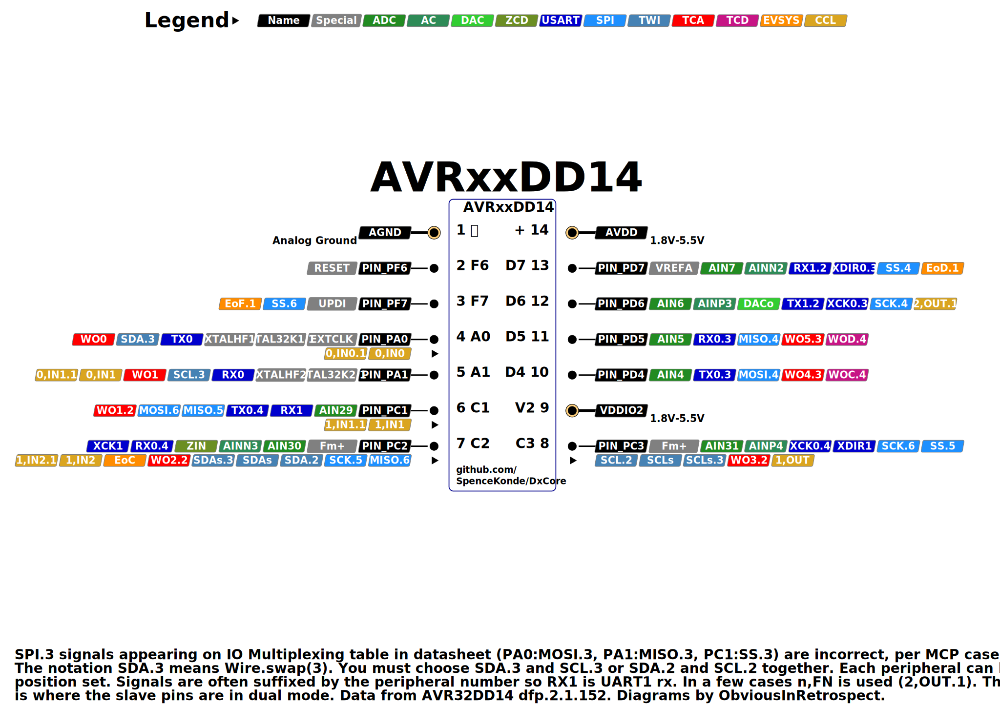

# AVR64DD14/AVR32DD14/AVR16DD14

## Pin Mapping / Pinout

## Features and Peripherals
| Feature                      | AVR16DD14       | AVR32DD14       | AVR64DD14       |
|------------------------------|-----------------|-----------------|-----------------|
| Flash Memory                 | 16384           | 32768           | 65536           |
| SRAM                         | 2048            | 4096            | 8192            |
| EEPROM                       | 256             | 256             | 256             |
| User Row                     | 32              | 32              | 32              |
| Max. Frequency (rated, MHz)  | 24              | 24              | 24              |
| Total pins on package        | 28              | 28              | 28              |
| Packages Available           | SOIC            | SOIC            | SOIC            |
| I/O Pins, not counting Reset | 9 (11)          | 9 (11)          | 9 (11)          |
| Of those, MVIO pins          | 3               | 3               | 3               |
| PWM capable I/O pins         | 7               | 7               | 7               |
| Max simultaneous PWM outputs | 5: 3+0+2        | 5: 3+0+2        | 5: 3+0+2        |
| 16-bit Type A Timer (TCA)    | 1               | 1               | 1               |
| 16-bit Type B Timer (TCB)    | 2 (no PWM)      | 2 (no PWM)      | 2 (no PWM)      |
| 12-bit Type D Timer (TCD)    | 1               | 1               | 1               |
| USART (pin mappings)         | 2 (3, 2)        | 2 (3, 2)        | 2 (3, 2)        |
| SPI (pin mappings)           | 1 (3)           | 1 (3)           | 1 (3)           |
| TWI/I2C                      | 1               | 1               | 1               |
| 12-bit ADC input pins        | 4/7             | 4/7             | 4/7             |
| Of those, neg. diff. inputs  | All             | All             | All             |
| 10-bit DAC                   | 1               | 1               | 1               |
| Analog Comparator (AC)       | 1               | 1               | 1               |
| Zero-Cross Detectors (ZCD)   | 1               | 1               | 1               |
| Opamp                        | NO              | NO              | NO              |
| Custom Logic Blocks (LUTs)   | 4               | 4               | 4               |
| Event System channels        | 6               | 6               | 6               |

## AVR DD - TinyAVR?  What's tinyAVR? ***I think you mean, what was tinyAVR***
*You glance around wondering where that forboding voice had come from*
If you aren't doubting the future of the ATtiny product line, you haven't been paying attention. The writing has been on the wall since the DA-series was released instead of a 1-series ATmega. Microchip had no attachment to the brand, and dropped it like a hot potato at the first opportunity. When the tinyAVR 2-series was announced, it could be pretended that everything was normal. But the DD and EA-series announcements made the direction clear. The Dx and Ex series are waging war on the market segment that would traditionally have gone for a tiny - the DD by pincount and EA by minimum flash size... Which really sorta makes sense, since they've got to the other side, and the'll never bear ARM in 32/64-bit (in fact, they've joined them and license ARM for their SAM-series).
Moreover, each tinyAVR generation has been used to flight test a set of features (the multiple comparators and TCD for 1-series, the new ADC for 2-series)... But is there a big new system looming? Certainly, unless they've done an extrordiary job of keeping it hush-hush, there doesn't seem to be, so all the more reason to start transitioning to microchippy brandnames.

Anyway, the DD-series parts are low-cost, low-pincount AVRs with MVIO and all the headline features of the DB except for the opamps and the sheer number of peripherals. And significantly expanded mapping options

| USART0: |  TX |  RX | XDIR | XCK |
|---------|-----|-----|------|-----|
| DEFAULT | PA0 | PA1 |   -  |  -  |
| ALT3    | PD4 | PD5 |  PD6 | PD7 |
| ALT4    | PC1 | PC2 |  PC3 |  -  |

| USART1  |  TX |  RX | XDIR | XCK |
|---------|-----|-----|------|-----|
| DEFAULT | PA0 | PA1 |   -  |  -  |
| ALT2    | PD6 | PD7 |   -  |  -  |

### SPI0 mux options

| SPI0    | MOSI | MISO | SCK |  SS |
|---------|------|------|-----|-----|
| DEFAULT |  Not |  ava | ila | ble |
| ALT4    |  PD4 |  PD5 | PD6 | PD7 |
| ALT5    |   -  |  PC1 | PC2 | PC3 |
| ALT6    |  PC1 |  PC2 | PC3 | PF7 |

### TCB mux options
There ain't none.
| TCBn | Default | Alt |
|------|---------|-----|
| TCB0 |      -  |  -  |
| TCB1 |      -  |  -  |
No TCB output pin exists as a physical pin on the DD14s

### TCD0 mux option
| TCD0    | WOA | WOB | WOC | WOD |
|---------|-----|-----|-----|-----|
| DEFAULT |  -  |  -  |  -  |  -  |
| Alt4    |  -  |  -  | PD4 | PD5 |
("default is not a valid option here as it has no pins, core defaults to ALT4, the only one with pins. ")

### TCA mux options
| TCA0    | WO0 | WO1 | WO2 | WO3 | WO4 | WO5 |
|---------|-----|-----|-----|-----|-----|-----|
| PORTA   | PA0 | PA1 |  -  |  -  |  -  |  -  |
| PORTC   |  -  | PC1 | PC2 | PC3 |  -  |  -  |
| PORTD   |  -  | -   |  -  |   - | PD4 | PD5 |
Yeah pretty bleak.

### TWI mux options

| Mapping | Master or Slave | Dual Mode Slave |
|---------|-----------------|-----------------|
| DEFAULT | Not avail.      | SDA/PC2 SCL/PC3 |
| ALT2    | SDA/PC2 SCL/PC3 | Not avail.      |
| ALT3    | SDA/PA0 SCL/PA1 | SDA/PC2 SCL/PC3 |

Note that this means that you want Wire.swap(0, 2, or 3, but not 1).

Like TCA, 1.5.0 of DxCore, if you set the TCD portmux (PORTMUX.TCD0ROUTEA), digitalWrite and analogWrite() will be aware of it (digitalWriteFast is never aware of PWM, don't use it to shut off PWM, it won't).

Until I get some of these in my hands I can't check a few other things. But there don't appear to be any fundamental changes here.

28-pin diagram done first because that's what I reckon most people will be using first.
