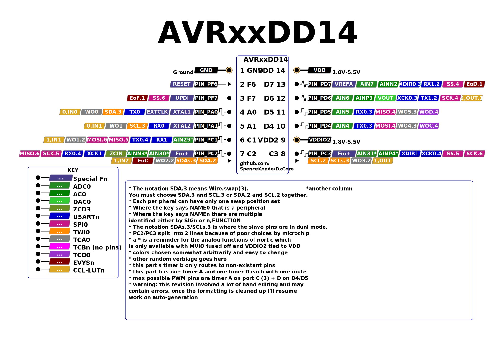

# AVR64DD14/AVR32DD14/AVR16DD14

## Pin Mapping / Pinout


## Features and Peripherals
| Feature                        | AVR16DD14       | AVR32DD14       | AVR64DD14       |
|--------------------------------|-----------------|-----------------|-----------------|
| Flash Memory                   | 16384           | 32768           | 65536           |
| Flash Memory (with Optiboot)   | 15872           | 32256           | 65024           |
| SRAM                           | 2048            | 4096            | 8192            |
| EEPROM                         | 256             | 256             | 256             |
| User Row                       | 32              | 32              | 32              |
| Max. Frequency (rated, MHz)    | 24              | 24              | 24              |
| Clock Sources                  | INT, EXT, XTAL  | INT, EXT, XTAL  | INT, EXT, XTAL  |
| Packages Available             | SOIC            | SOIC            | SOIC            |
| Total pins on package          | 14              | 14              | 14              |
| I/O Pins (not reset/UPDI)      | 9               | 9               | 9               |
| Fully async pins               | 11              | 11              | 11              |
| UPDI as I/O Pin                | Yes             | Yes             | Yes             |
| PWM capable I/O pins           | 7               | 7               | 7               |
| Max simultaneous PWM outputs   | 5: 3+2          | 5: 3+2          | 5: 3+2          |
| 16-bit Type A Timers - pins ea | 1: 2/3/2        | 1: 2/3/2        | 1: 2/3/2        |
| 16-bit Type B Timers, (pins)   | 2: 0            | 2: 0            | 2: 0            |
| 12-bit Type D pins             | 2               | 2               | 2               |
| USART (pin mappings)           | 2: 3/1          | 2: 3/1          | 2: 3/1          |
| SPI (pin mappings)             | 1: 2            | 1: 2            | 1: 2            |
| TWI/I2C (pin mappings)         | 1: 2            | 1: 2            | 1: 2            |
| 12-bit ADC input pins          | 4/7             | 4/7             | 4/7             |
| Of those, neg. diff. inputs    | all             | all             | all             |
| 10-bit DAC                     | 1               | 1               | 1               |
| Analog Comparator (AC)         | 1               | 1               | 1               |
| Zero-Cross Detectors (ZCD)     | 1               | 1               | 1               |
| Custom Logic Blocks (LUTs)     | 4               | 4               | 4               |
| Event System channels (out pins)| 6: 3           | 6: 3            | 6: 3            |
| On-chip opamps (OPAMP)         | -               | -               | -               |
| MVIO, pins                     | Yes, 3          | Yes, 3          | Yes, 3          |
| Flash Endurance                | 1k              | 1k              | 1k              |
| LED_BUILTIN (and optiboot led) | PIN_PD7         | PIN_PD7         | PIN_PD7         |

## AVR DD14 - DD-tier peripherals in a tinyAVR size package
The DD-series parts are low-cost, low-pincount AVRs with MVIO and all the headline features of the DB except for the opamps and the sheer number of peripherals. To make the most of the small pincount, these have significantly expanded mapping options for USART0, USART1, SPI0, and TWI0.

### Fully async pins
All pins on the DDs are supposedly fully async, instead of just pins 2 and 6 within each port. Whether this is actually a good thing or not can be debated.

### USART mux options

| USART0: | swap |  TX |  RX | XDIR | XCK |
|---------|------|-----|-----|------|-----|
| DEFAULT | 0    | PA0 | PA1 |   -  |  -  |
| ALT3    | 3    | PD4 | PD5 |  PD6 | PD7 |
| ALT4    | 4    | PC1 | PC2 |  PC3 |  -  |

| USART1  | swap |  TX |  RX | XDIR | XCK |
|---------|------|-----|-----|------|-----|
| ~DEFAULT~ | ~0~ | ~-~ | ~PC1~ | ~PC2~ | ~PC3~ |
| ALT2    | 2    | PD6 | PD7 |   -  |  -  |
DEFAULT is not terribly useful here, though implemented in the hardware. We don't have a graceful way to propagate the swap level when creating the USART objects though, and arguments against changing PORTMUX options willy-nilly have some weight. Just call swap(2).

### SPI0 mux options
| SPI0    | swap | MOSI | MISO | SCK |  SS |
|---------|------|------|------|-----|-----|
| ALT4    | 4    |  PD4 |  PD5 | PD6 | PD7 |
| ~ALT5~  | ~5~  |  ~-~ | ~PC1~ | ~PC2~ | ~PC3~ |
| ALT6    | 6    |  PC1 |  PC2 | PC3 | PF7 |

ALT5 is not the most useful multiplexing option, and should probably not be used - ALT6 however gives you SPI on the right pins of PORTC to be useful for MVIO, while ALT4 (the default) gives you non-MVIO-referenced SPI levels.

### TWI0 mux options
| Mapping | swap | Master or Slave | Dual Mode Slave |
|---------|------|-----------------|-----------------|
| ~DEFAULT~ | ~0~ | ~Not avail.~ | ~SDA/PC2 SCL/PC3~ |
| ALT2    | 2    | SDA/PC2 SCL/PC3 | Not avail.      |
| ALT3    | 3    | SDA/PA0 SCL/PA1 | SDA/PC2 SCL/PC3 |

Note that this means that you want Wire.swap(2, or 3, but not 0 or 1). While swap level 0 is "implemented" in hardware it is not useful - you can do everything you could with swap 0 using swap 2 or swap3 3 and then some - and with binary size smaller than or equal to what can be achieved with swap 0. None of the pins used by swap 1 exist at all.

### PWM Pins
With 14 pins, there isn't a whole lot of choice...
* TCA0 obviously wants to be on PORTC. On PORTD it would be fully redundant with the TCD, and PA0 and PA1 are the pins used for external clock sources.
* TCD0 only has pins on PORTD, so we set that by default
* The TCBs don't get used for PWM. They support no pins present.

#### TCA0 mux options
The Type A timers (TCA0) can be mapped to different pins as a group only, and analogWrite() is PORTMUX-aware - you can set TCA0 to output on any port's pin 0-5. Using this feature is easy - you simply write to the portmux register `PORTMUX.TCAROUTEA = (TCA0 pinset)` and then analogWrite() normally. TCA0 pinset is the port number (0-5 for ports A-F).

| TCA0    | WO0 | WO1 | WO2 | WO3 | WO4 | WO5 |
|---------|-----|-----|-----|-----|-----|-----|
| PORTA   | PA0 | PA1 |  -  |  -  |  -  |  -  |
| PORTC   |  -  | PC1 | PC2 | PC3 |  -  |  -  |
| PORTD   |  -  | -   |  -  |   - | PD4 | PD5 |

Yeah - for a timer with 6 PWM outputs, these pin mapping options are pretty bleak.

It is strongly recommended to not have any PWM output enabled involving either the timer being moved nor the pins it is being moved to when setting `PORTMUX.TCAROUTEA`. In the latter case, you will not be able to turn off the existing PWM through the API functions.
```c
PORTMUX.TCAROUTEA = PORTMUX_TCA0_PORTF_gc | PORTMUX_TCA1_PORTB_gc; // PWM on PORTF and PORTB pins 0-5
PORTMUX.TCAROUTEA = (PORTMUX.TCAROUTEA & PORTMUX_TCA1_gm) | PORTMUX_TCA0_PORTD_gc; // Move TCA0 PWM to PORTD but don't change TCA0
// The first option is slightly faster, as it isn't a read-modify-write.
// Note that PORTMUX_TCA0_PORTA_gc and PORTMUX_TCA1_PORTB_gc have a numeric value of 0.
```

#### TCB mux options
No TCB output pin exists as a physical pin on the DD14s

#### TCD0 mux option
| TCD0    | WOA | WOB | WOC | WOD |
|---------|-----|-----|-----|-----|
| Alt4    |  -  |  -  | PD4 | PD5 |

Only one set of pins actually exists. Default is not a valid option here as it has no pins, core defaults to ALT4, the only one with pins.

## Official Documentation:
The official product page contains links to the datasheet, errata, and some application notes.
* [AVR64DD14 product page](https://www.microchip.com/en-us/product/AVR64DD14)
* [AVR32DD14 product page](https://www.microchip.com/en-us/product/AVR32DD14)
* [AVR16DD14 product page](https://www.microchip.com/en-us/product/AVR32DD14)
