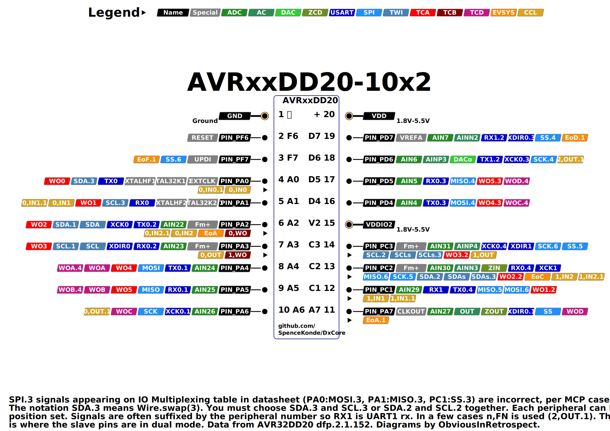
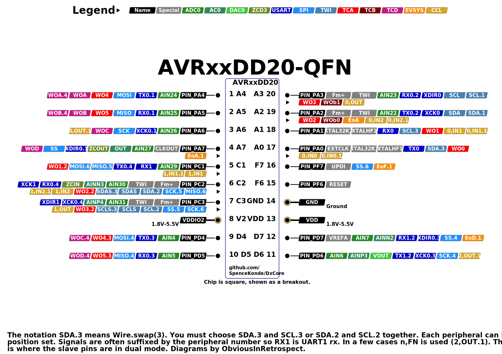

# AVR64DD20/AVR32DD20/AVR16DD20

## Pin Mapping / Pinout
### SOIC

### QFN
This pinout image is temporary - I know we had the proper square version ready but not what happened to it.

## Features and Peripherals
| Feature                          | AVR16DD20       | AVR32DD20       | AVR64DD20       |
|----------------------------------|-----------------|-----------------|-----------------|
| Flash Memory                     | 16384           | 32768           | 65536           |
| Flash Memory (with Optiboot)     | 15872           | 32256           | 65024           |
| SRAM                             | 2048            | 4096            | 8192            |
| EEPROM                           | 256             | 256             | 256             |
| User Row                         | 32              | 32              | 32              |
| Max. Frequency (rated, MHz)      | 24              | 24              | 24              |
| Clock Sources                    | INT, EXT, XTAL  | INT, EXT, XTAL  | INT, EXT, XTAL  |
| Packages Available               | SOIC-W, VQFN20  | SOIC-W, VQFN20  | SOIC-W, *VQFN20?* |
| Total pins on package            | 20              | 20              | 20              |
| I/O Pins (not reset/UPDI)        | 15              | 15              | 15              |
| Fully async pins                 | 17              | 17              | 17              |
| UPDI as I/O Pin                  | Yes             | Yes             | Yes             |
| PWM capable I/O pins             | 13              | 13              | 13              |
| Max simultaneous PWM outputs     | 8: 6+2          | 8: 6+2          | 8: 6+2          |
| 16-bit Type A Timers - pins ea   | 1: 6/3/2        | 1: 6/3/2        | 1: 6/3/2        |
| 16-bit Type B Timers, (pins)     | 2: 2            | 2: 2            | 2: 2            |
| 12-bit Type D pins               | 6               | 6               | 6               |
| USART (pin mappings)             | 2: 3/1          | 2: 3/1          | 2: 3/1          |
| SPI (pin mappings)               | 1: 3            | 1: 3            | 1: 3            |
| TWI/I2C (pin mappings)           | 1: 3            | 1: 3            | 1: 3            |
| 12-bit ADC input pins            | 10/13           | 10/13           | 10/13           |
| Of those, neg. diff. inputs      | all             | all             | all             |
| 10-bit DAC                       | 1               | 1               | 1               |
| Analog Comparator (AC)           | 1               | 1               | 1               |
| Zero-Cross Detectors (ZCD)       | 1               | 1               | 1               |
| Custom Logic Blocks (LUTs)       | 4               | 4               | 4               |
| Event System channels (out pins) | 6: 5            | 6: 5            | 6: 5            |
| On-chip opamps (OPAMP)           | -               | -               | -               |
| MVIO, pins                       | Yes, 3          | Yes, 3          | Yes, 3          |
| Flash Endurance                  | 1k              | 1k              | 1k              |
| LED_BUILTIN (and optiboot led)   | PIN_PA7         | PIN_PA7         | PIN_PA7         |

* If targeting the most PWM channels, the only option for the two TCBs overlaps with pins that TCA can use in its most favorable spot.
* VQFN is the ultra-tiny 3mm x 3mm 0.4mm pitch one. 64k DD20s are not available in VQFN as of the time of writing and in fact may never be. I got neither direct confirmation nor refutation from my guy on the inside, but the phasing of his response is suggestive of my guess being correct.

`*` As with all Dx-series, the flash didn't live up to expectations at extreme conditions. 1k is the worst case rating though, and under typical conditions, it is believed that the endurance is >= 10k cycles. I do not know how far along Microchip is in developing a solution, but it's being treated as datasheet clarification, so that's not encouraging. I am hoping for additional information on how flash endurance is influenced by various factors.

## AVR DD - This is more akin to a souped up tinyAVR than a poverty model Dx
The 20 and 14 pin DD-series parts first released were 32k and 16k parts with the 64-pin version following later in 2022 (but apparently only in SOIC package), are much more exciting than their larger brothers, because they bring in Dx-class features at a price barely exceeding that of a tinyAVR. All the feature checkboxes are nice and full. They're much cheaper than DB-series, barely above ATtiny parts - but they come with most of the full suite of features. Obviously some things were cut versus the DB - memory being the most obvious, and the peripheral count is lower as one would expect for a smaller device with fewer pins.

The real catch with the DB20 - is there's no AVR64DD20-REB (QFN 3mm x 3mm package). The die wouldn't fit in a 3mm x 3mm QFN (not explicitly confirmed, but highly likely based on my findings from filing the epoxy off the top of a few chips to measure the die). This really is too bad. If they had made a TSSOP and could have sold it for prices offering more than, oh, 2 cents price advantage over most expensive SMT package of the part with 8 more pins.....?

Yeah I can't really recommend the AVR64DD20 with a straight face. AVR32DD20? Absolutely, look how little board space it takes up, and they're not half as hard to solder as they look. AVR64DD14? Yup that exists and in a reasonable package at an affordable price. AVR64DD28? That exists in a QFN for an insanely low price.
AVR64DD20? Maybe not one of those except as a development testbed or something.

### Fully async pins
All pins on the DDs are "fully async" and can respond to events shorter than 1 clock cycle, and can wake the chip on RISING or FALLING edges, not just LOW_LEVEL and CHANGE, whether or not the I/O clock is running. There are good and bad sides to this. The good are obvious, the bad is reduced noise rejection if you're able to respond to such brief signals.

### USART mux options

#### USART0 mux options
| USART0  | swap |  TX |  RX | XDIR | XCK |
|---------|------|-----|-----|------|-----|
| DEFAULT | 0    | PA0 | PA1 |  PA2 | PA3 |
| ALT1    | 1    | PA4 | PA5 |  PA6 | PA7 |
| ALT2    | 2    | PA2 | PA3 |   -  |  -  |
| ALT3    | 3    | PD4 | PD5 |  PD6 | PD7 |
| ALT4    | 4    | PC1 | PC2 |  PC3 |  -  |

#### USART1 mux options
As default is kinda useless, USART1 defaults to swap(2).

| USART1  | swap |  TX |  RX | XDIR | XCK |
|---------|------|-----|-----|------|-----|
| ~DEFAULT~ | ~0~ | ~-~ | ~PC1~ | ~PC2~ | ~PC3~ |
| ALT2    | 2    | PD6 | PD7 |   -  |  -  |

### SPI0 mux options
ALT5 and ALT3 are not particularly useful, as they are both lacking one of the critical pins. ALT6 however gives you SPI on the right pins of PORTC to be useful for MVIO, while DEFAULT or ALT4 gives you non-MVIO-referenced SPI levels.

| SPI0    | swap | MOSI | MISO | SCK |  SS |
|---------|------|------|------|-----|-----|
| DEFAULT | 0    |  PA4 |  PA5 | PA6 | PA7 |
| ~ALT3~  | ~3~  | ~PA0~ | ~PA1~ | ~-~ | ~PC1~ |
| ALT4    | 4    |  PD4 |  PD5 | PD6 | PD7 |
| ~ALT5~  | ~5~  |  ~-~ | ~PC1~ | ~PC2~ | ~PC3~ |
| ALT6    | 6    |  PC1 |  PC2 | PC3 | PF7 |

### TWI0 mux options
Note that this means that you want Wire.swap(0, 2, or 3, but not 1). PA0 and PA1 are unavailable if using an external crystal.

| Mapping | swap | Master or Slave | Dual Mode Slave |
|---------|------|-----------------|-----------------|
| DEFAULT | 0    | SDA/PA2 SCL/PA3 | SDA/PC2 SCL/PC3 |
| ~ALT1~  | ~1~  | ~SDA/PA2 SCL/PA3~ | ~Not avail.~  |
| ALT2    | 2    | SDA/PC2 SCL/PC3 | Not avail.      |
| ALT3    | 3    | SDA/PA0 SCL/PA1 | SDA/PC2 SCL/PC3 |

### PWM Pins
With 20 pins, there still isn't a whole lot of choice...
* TCA0 obviously wants to be on PORTA, the only port with more than half of its outputs.
* TCD0 can go either way as required, we leave it at default.
* The TCBs don't get used for PWM - they share PA2 and PA3 with TCA0, and no different PORTMUX option can return at least the three pins you lose from switching to PORTC instead of PORTA, though they will be used if PORTMUX is set to point TCA0 to a port other than PORTA, and the timer isn't being used for millis, which TCB1 usually is.

#### TCA mux options
The Type A timers (TCA0) can be mapped to different pins as a group only, and analogWrite() is PORTMUX-aware - you can set TCA0 to output on any port's pin 0-5. Using this feature is easy - you simply write to the portmux register `PORTMUX.TCAROUTEA = (TCA0 pinset)` and then analogWrite() normally. TCA0 pinset is the port number (0-5 for ports A-F), or one of the named constants of the form: PORTMUX_TCA0_PORTx_gc where x is A, C, or D.
| TCA0    | WO0 | WO1 | WO2 | WO3 | WO4 | WO5 |
|---------|-----|-----|-----|-----|-----|-----|
| **PORTA** | **PA0** | **PA1** | **PA2** | **PA3** | **PA4** | **PA5** |
| PORTC   |  -  | PC1 | PC2 | PC3 |  -  |  -  |
| PORTD   |  -  | PD1 | PD2 | PD3 | PD4 | PD5 |

#### TCB mux options
Not much of a choice, and are not used by default since those pins are shared with the "best" TCA0 mapping.

| TCBn | Default | Alt |
|------|---------|-----|
| TCB0 | **PA2** |  -  |
| TCB1 | **PA3** |  -  |

#### TCD0 mux options
Like TCA, in 1.5.0 of DxCore, if you set the TCD portmux (`PORTMUX.TCDROUTEA`), digitalWrite and analogWrite() will be aware of it (digitalWriteFast is never aware of PWM, don't use it to shut off PWM, it won't). TCA is used in preference to TCD when both are available on one pin. Since default is usable, we don't change it.

| TCD0    | WOA | WOB | WOC | WOD |
|---------|-----|-----|-----|-----|
| **DEFAULT** | **PA4** | **PA5** | **PA6** | **PA7** |
| ALT4    | PA4 | PA5 | PD4 | PD5 |

### LED_BUILTIN
Thank god - we have a PA7 here!

To match other parts, `PIN_PA7` shall be the pin that the core "expects" to be connected to an LED. If you want to have a different pin be recognized by the application (this does not change the bootloader - you would still need to do a custom build of that too), this can be overridden if a custom board definition is created by passing `-DLED_BUILTIN=(some other pin)` as part of build_extra_flags, building via the CLI, or by equivalent means provided by other third party development environments.

## Official Documentation
When all else fails, read the real documentation. They keep moving the .pdf files around, so now I just link to the prduct page, from whence the datasheet, errata, and "technical briefs".

**Datasheets and errata change. You can sign up to get emails about such changes through the Microchip PCN system; if you don't, be sure to always use the latest version of the datasheet and especially the errata**

* [AVR64DD20 product page](https://www.microchip.com/en-us/product/AVR64DD20)
* [AVR32DD20 product page](https://www.microchip.com/en-us/product/AVR32DD20)
* [AVR16DD20 product page](https://www.microchip.com/en-us/product/AVR16DD20)

At a minimum, everyone using a modern AVR should plan on having a PDF viewer open with the datasheet, and a text editor with a good search function and the ioavr______.h file open so that when you're trying to use a constant, but the compiler says it isn't declared/defined, you can search the io header for a key phrase in the constant and figure out how it was spelled/formatted or copy/paste it to your sketch. (see [the IO headers](./ioheaders) for more information and links to them. I also keep the AVR instruction set manual open in the PDF viewer as well as the silicon errata and datasheet clarification. Datasheet clarifications are a bigger deal than an erratum, usually. An erratum says "Okay, this doesn't work, but it will some day, maybe" while a datasheet clarification says "This would be an errata, but we're not even going to pretend that we'll fix it some day". But watch out - datasheet clarifications vanish from the list once the datasheet has been updated!

The "Technical Briefs" are [somewheat inconsistent](https://github.com/SpenceKonde/AVR-Guidance/blob/master/TechnicalBriefs.md) in their value, but some are quite good.
