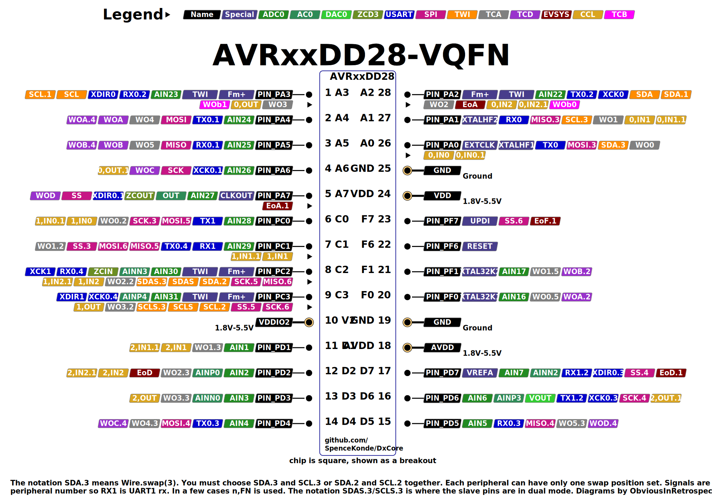

# AVR64DD28/AVR32DD28/AVR16DD28

## Pin Mapping / Pinout

## Features and Peripherals
| Feature                      | AVR16DD28       | AVR32DD28       | AVR64DD28       |
|------------------------------|-----------------|-----------------|-----------------|
| Flash Memory                 | 16384           | 32768           | 65536           |
| SRAM                         | 2048            | 4096            | 8192            |
| EEPROM                       | 256             | 256             | 256             |
| User Row                     | 32              | 32              | 32              |
| Max. Frequency (rated, MHz)  | 24              | 24              | 24              |
| Total pins on package        | 28              | 28              | 28              |
| Packages Available           | SOIC, SSOP,     | SOIC, SSOP,     | SOIC, SSOP,     |
| Packages Available           | VQFN28          | VQFN28          | VQFN28          |
| I/O Pins, not counting Reset | 21 (20)         | 21 (20)         | 21 (20)         |
| Of those, MVIO pins          | 4               | 4               | 4               |
| PWM capable I/O pins         | 19              | 19              | 19              |
| Max simultaneous PWM outputs | 9: 6+1+2        | 8: 6+1+2        | 8: 6+1+2        |
| PWM outputs with default map |                 |                 |                 |
| 16-bit Type A Timer (TCA)    | 1               | 1               | 1               |
| 16-bit Type B Timer (TCB)    | 3               | 3               | 3               |
| 12-bit Type D Timer (TCD)    | 1               | 1               | 1               |
| USART (pin mappings)         | 2 (5, 2)        | 2 (5, 2)        | 2 (5, 2)        |
| SPI (pin mappings)           | 1 (5)           | 1 (5)           | 1 (5)           |
| TWI/I2C                      | 1               | 1               | 1               |
| 12-bit ADC input pins        | 15/19           | 15/19           | 15/19           |
| Of those, neg. diff. inputs  | All             | All             | All             |
| 10-bit DAC                   | 1               | 1               | 1               |
| Analog Comparator (AC)       | 1               | 1               | 1               |
| Zero-Cross Detectors (ZCD)   | 1               | 1               | 1               |
| Opamp                        | NO              | NO              | NO              |
| Custom Logic Blocks (LUTs)   | 4               | 4               | 4               |
| Event System channels        | 6               | 6               | 6               |

## AVR DD28 - Povery model DB without the opamps and fewer peripherals, but with a bunch of errata fixes and added port mappings

That basically sums up the DD28 and DD32 parts. They're much cheaper than DB-series, barely above ATtiny parts, but come with most of the full suite of features. Obviously some things were cut versus the DB: Memory is halved (they're still cheap compared to the 32/64k DBs); 16/32/64 flash with 2/4/8k of SRAM. Amd there is only 1 analog comparator and no USART2. Similarly, we're down to just one SPI and I2C peripheral. On the other hand, the pin multipleximg options of USART0 and SPI0 have gotten luxury treatment. Note also that the alternate pin mapping numbers don't start at 1. For SPI, alt 1 and 2 are not available, nor is the ALT1 mapping of USART available.... but ALT2 is, placing TX and RX on PD6 and PD7 respectively.... *Arriving "fashionably late" to the portmux party, poor USART1 arrived to find that USART0 and SPI0 had already eaten the whole cake, drained the punchbowl, and left. They were left sucking on icecubes and licking up crumbs, along with TCA0 and TCD0, each picking up one mux option.* USART2 missed the event altogether, and it's unknown when he'll next be seen.
### USART0 mux options
| USART0  |  TX |  RX | XDIR | XCK |
|---------|-----|-----|------|-----|
| DEFAULT | PA0 | PA1 |  PA2 | PA3 |
| ALT1    | PA4 | PA5 |  PA6 | PA7 |
| ALT2    | PA2 | PA3 |   -  |  -  |
| ALT3    | PD4 | PD5 |  PD6 | PD7 |
| ALT4    | PC1 | PC2 |  PC3 |  -  |

### USART1 mux options
| USART1  |  TX |  RX | XDIR | XCK |
|---------|-----|-----|------|-----|
| DEFAULT | PC0 | PC1 |  PC2 | PC3 |
| ALT2    | PD6 | PD7 |   -  |  -  |

### SPI0 mux options
SPI0 and USART0 have a ton of mapping options!
| SPI0    | MOSI | MISO | SCK |  SS |
|---------|------|------|-----|-----|
| DEFAULT |  PA4 |  PA5 | PA6 | PA7 |
| ALT3    |  PA0 |  PA1 | PC0 | PC1 |
| ALT4    |  PD4 |  PD5 | PD6 | PD7 |
| ALT5    |  PC0 |  PC1 | PC2 | PC3 |
| ALT6    |  PC1 |  PC2 | PC3 | PF7 |
Core defaults to the usual default

### TCD0 mux options
Set for the port as a whole.
| TCD0    | WOA | WOB | WOC | WOD |
|---------|-----|-----|-----|-----|
| DEFAULT | PA4 | PA5 | PA6 | PA7 |
| ALT2    | PF0 | PF1 |  -  |  -  |
| ALT4    | PA4 | PA5 | PD4 | PD5 |
Note Core selects ALT4 for 32-pin parts as default during startup. You may change this normally. This maximizes available PWM channels.

### TCA0 mux options
Set for the port as a whole.

| TCA0    | WO0 | WO1 | WO2 | WO3 | WO4 | WO5 |
|---------|-----|-----|-----|-----|-----|-----|
| PORTA   | PA0 | PA1 | PA2 | PA3 | PA4 | PA5 |
| PORTC   | PC0 | PC1 | PC2 | PC3 |  -  |  -  |
| PORTD   |  -  | PD1 | PD2 | PD3 | PD4 | PD5 |
| PORTF   | PF0 | PF1 |  -  |  -  |  -  |  -  |

Note: Core selects PORTA for 28-pin partsas default during startup. You may change this normally. This maximizes available PWM channels.
