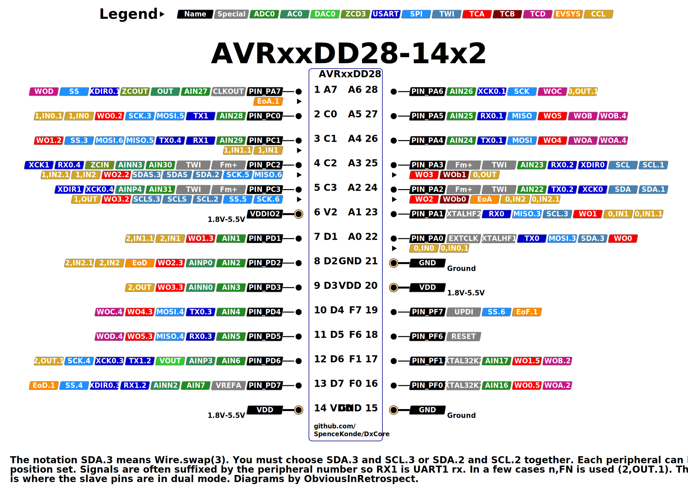
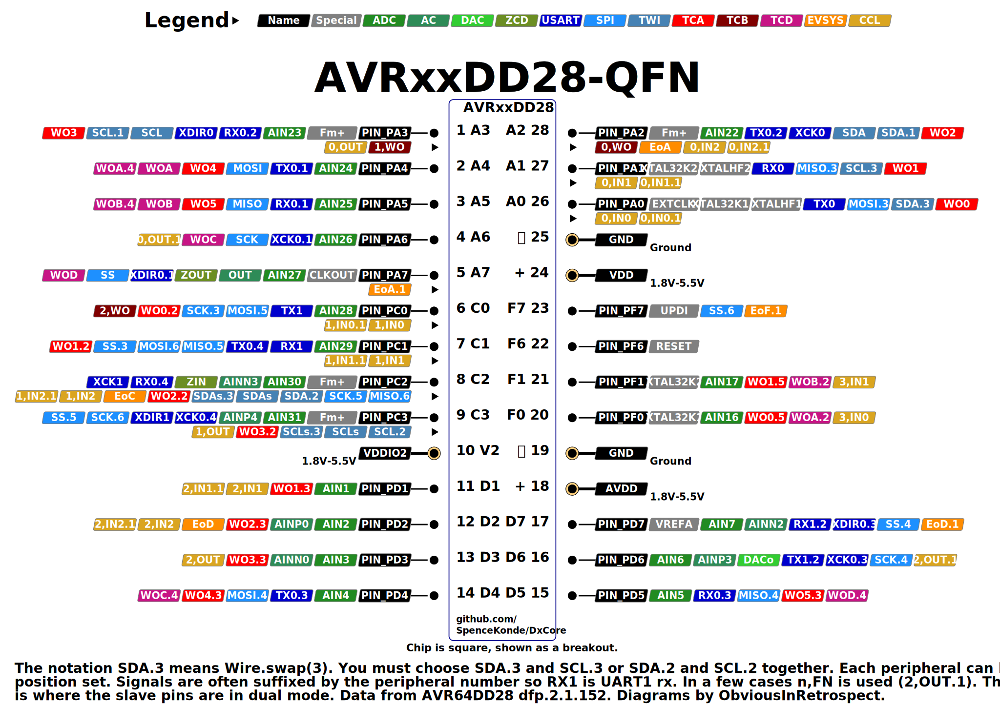

# AVR64DD28/AVR32DD28/AVR16DD28

## Pin Mapping / Pinout
### SOIC/SSOP/DIP

### QFN
This pinout image is temporary - I know we had the proper square version ready but not what happened to it.

## Features and Peripherals
| Feature                          | AVR16DD28       | AVR32DD28       | AVR64DD28       |
|----------------------------------|-----------------|-----------------|-----------------|
| Flash Memory                     | 16384           | 32768           | 65536           |
| Flash Memory (with Optiboot)     | 15872           | 32256           | 65024           |
| SRAM                             | 2048            | 4096            | 8192            |
| EEPROM                           | 256             | 256             | 256             |
| User Row                         | 32              | 32              | 32              |
| Max. Frequency (rated, MHz)      | 24              | 24              | 24              |
| Clock Sources                    | INT, EXT, XTAL  | INT, EXT, XTAL  | INT, EXT, XTAL  |
| Packages Available               | SOIC, SSOP,     | SOIC, SSOP,     | SOIC, SSOP,     |
| Packages Available               | *DIP28,VQFN28?* | *DIP28,VQFN28?* | VQFN28          |
| Total pins on package            | 28              | 28              | 28              |
| I/O Pins, not counting Reset     | 21              | 21              | 21              |
| Fully async pins                 | 23              | 23              | 23              |
| UPDI as I/O Pin                  | Yes             | Yes             | Yes             |
| PWM capable I/O pins             | 19              | 19              | 19              |
| Max simultaneous PWM outputs     | 11: 6:2:3       | 11: 6:2:3       | 11: 6:2:3       |
| 16-bit Type A Timers - pins ea   | 1: 6/4/5/2      | 1: 6/4/5/2      | 1: 6/4/5/2      |
| 16-bit Type B Timers, (pins)     | 3: 3            | 3: 3            | 3: 3            |
| 12-bit Type D pins               | 6               | 6               | 6               |
| USART (pin mappings)             | 2: 3/1          | 2: 3/1          | 2: 3/1          |
| SPI (pin mappings)               | 1: 5            | 1: 5            | 1: 5            |
| TWI/I2C (pin mappings)           | 1: 3            | 1: 3            | 1: 3            |
| 12-bit ADC input pins            | 14/18           | 14/18           | 14/18           |
| Of those, neg. diff. inputs      | all             | all             | all             |
| 10-bit DAC                       | 1               | 1               | 1               |
| Analog Comparator (AC)           | 1               | 1               | 1               |
| Zero-Cross Detectors (ZCD)       | 1               | 1               | 1               |
| Custom Logic Blocks (LUTs)       | 4               | 4               | 4               |
| Event System channels (out pins) | 6: 6            | 6: 6            | 6: 6            |
| On-chip opamps (OPAMP)           | -               | -               | -               |
| MVIO, pins                       | Yes, 4          | Yes, 4          | Yes, 4          |
| Flash Endurance                  | 1k              | 1k              | 1k              |
| LED_BUILTIN (and optiboot led)   | PIN_PA7         | PIN_PA7         | PIN_PA7         |

* VQFN is 4mm x 4mm 0.4mm pitch. 16 and 32k parts in this package are not for sale at time of this writing.
* SSOP is 5.3mm wide

## AVR DD28 - Povery model DB without the opamps and fewer peripherals, but with a bunch of errata fixes and added port mappings

That basically sums up the DD28 and DD32 parts. They're much cheaper than DB-series, barely above ATtiny parts, but come with most of the full suite of features. Obviously some things were cut versus the DB - they still come in three sizes, but the sizes have half the flash. There is only 1 analog comparator and no USART2, and we're down to just one SPI and I2C peripheral. On the other hand, the pin multipleximg options of USART0 and SPI0 have gotten luxury treatment. Note also that the alternate pin mapping numbers don't start at 1.

The 8 pins that the 28-pin parts pick up versus the 20-pin parts are PC0, PD1-3, PF0-1, and 1 each Vdd and Gnd.

### Fully async pins
All pins on the DDs are supposedly fully async, instead of just pins 2 and 6 within each port. Whether this is actually a good thing or not can be debated.

### USART0 mux options
(options for which no pins are available are not listed, and options missing critical pins or which are strictly worse than another pinset are ~structhrough~)

| USART0  | swap |  TX |  RX | XDIR | XCK |
|---------|------|-----|-----|------|-----|
| DEFAULT | 0    | PA0 | PA1 |  PA2 | PA3 |
| ALT1    | 1    | PA4 | PA5 |  PA6 | PA7 |
| ALT2    | 2    | PA2 | PA3 |   -  |  -  |
| ALT3    | 3    | PD4 | PD5 |  PD6 | PD7 |
| ALT4    | 4    | PC1 | PC2 |  PC3 |  -  |

### USART1 mux options
| USART1  | swap |  TX |  RX | XDIR | XCK |
|---------|------|-----|-----|------|-----|
| DEFAULT | 0    | PC0 | PC1 |  PC2 | PC3 |
| ALT2    | 2    | PD6 | PD7 |   -  |  -  |

### SPI0 mux options
| SPI0    | swap | MOSI | MISO | SCK |  SS |
|---------|------|------|------|-----|-----|
| DEFAULT | 0    |  PA4 |  PA5 | PA6 | PA7 |
| ALT3    | 3    |  PA0 |  PA1 | PC0 | PC1 |
| ALT4    | 4    |  PD4 |  PD5 | PD6 | PD7 |
| ALT5    | 5    |  PC0 |  PC1 | PC2 | PC3 |
| ALT6    | 6    |  PC1 |  PC2 | PC3 | PF7 |

Suddenly we have 5 usable mux options!

### TWI0 mux options
| Mapping | swap | Master or Slave | Dual Mode Slave |
|---------|------|-----------------|-----------------|
| DEFAULT | 0    | SDA/PA2 SCL/PA3 | SDA/PC2 SCL/PC3 |
| ~ALT1~  | ~1~  | ~SDA/PA2 SCL/PA3~ | ~Not avail.~  |
| ALT2    | 2    | SDA/PC2 SCL/PC3 | Not avail.      |
| ALT3    | 3    | SDA/PA0 SCL/PA1 | SDA/PC2 SCL/PC3 |

Note that this means that you want Wire.swap(0, 2, or 3, but not 1).

### PWM Pins
Even with 28 pins, there still isn't a whole lot of choice...
* TCA0 goes on PORTD to match how the DB does it. This is less than ideal, but there is just so much comp for PORTA pins.
* TCD0 can go either way as required, we leave it at default. PF0/1, PD4/5, and PF0/1 are not used for
* The TCBs don't get used for PWM - they share PA2 and PA3 with TCA0, and no different PORTMUX option can return at least the three pins you lose from switching to PORTC instead of PORTA, though they will be used if PORTMUX is set to point TCA0 to a port other than PORTA, and the timer isn't being used for millis, which TCB1 usually is.

#### TCA mux options
| TCA0    | WO0 | WO1 | WO2 | WO3 | WO4 | WO5 |
|---------|-----|-----|-----|-----|-----|-----|
| PORTA   | PA0 | PA1 | PA2 | PA3 | PA4 | PA5 |
| PORTC   |  -  | PC1 | PC2 | PC3 |  -  |  -  |
| **PORTD** | - | **PD1** | **PD2** | **PD3** | **PD4** | **PD5** |
| PORTF   | PF0 | PF1 |  -  |  -  |  -  |  -  |

analogWrite() is "PORTMUX-aware" and if you set `PORTMUX.TCAROUTEA` to a value other than 0, that sets the port to be used. PORTC is 2, PORTD is 3, as you would expect.

#### TCB mux options
| TCBn | Default | Alt |
|------|---------|-----|
| TCB0 | **PA2** |  -  |
| TCB1 | **PA3** |  -  |
| TCB2 | **PC0** |  -  |

Not much of a choice. PC0 is the only one that's useful without changing portmux options, though TCB2 by default is used for millis, though TCB1 is in many ways a better option.

#### TCD0 mux options
| TCD0    | WOA | WOB | WOC | WOD |
|---------|-----|-----|-----|-----|
| **DEFAULT** | **PA4** | **PA5** | **PA6** | **PA7** |
| ALT2    | PF0 | PF1 |  -  |  -  |
| ALT4    | PA4 | PA5 | PD4 | PD5 |

Like TCA, in 1.5.0 of DxCore, if you set the TCD portmux (`PORTMUX.TCDROUTEA`), digitalWrite and analogWrite() will be aware of it (digitalWriteFast is never aware of PWM, don't use it to shut off PWM, it won't). TCA is used in preference to TCD when both are available on one pin. Since default is usable, we don't change it.

### LED_BUILTIN
To match other parts, `PIN_PA7` shall be the pin that the core "expects" to be connected to an LED. If you want to have a different pin be recognized by the application (this does not change the bootloader - you would still need to do a custom build of that too), this can be overridden if a custom board definition is created by passing `-DLED_BUILTIN=(some other pin)` as part of build_extra_flags, building via the CLI, or by equivalent means provided by other third party development environments.

## Official Documentation
When all else fails, read the real documentation. They keep moving the .pdf files around, so now I just link to the prduct page, from whence the datasheet, errata, and "technical briefs".

* [AVR64DD28 product page](https://www.microchip.com/en-us/product/AVR64DD28)
* [AVR32DD28 product page](https://www.microchip.com/en-us/product/AVR32DD28)
* [AVR16DD28 product page](https://www.microchip.com/en-us/product/AVR32DD28)

At a minimum, everyone using a modern AVR should plan on having a PDF viewer open with the datasheet, and a text editor with a good search function and the ioavr______.h file open so that when you're trying to use a constant, but the compiler says it isn't declared/defined, you can search the io header for a key phrase in the constant and figure out how it was spelled/formatted or copy/paste it to your sketch. (see [the IO headers](./ioheaders) for more information and links to them. I also keep the AVR instruction set manual open in the PDF viewer as well as the silicon errata and datasheet clarification. Datasheet clarifications are a bigger deal than an erratum, usually. An erratum says "Okay, this doesn't work, but it will some day, maybe" while a datasheet clarification says either "This would be an errata, but we're not even going to pretend that we'll fix it some day" or occasionally "there is poor communication between the engineering and documentation departments".

### Technuical briefs
Technical briefs are what Microchip calls the sort of documents that most of the industry refers to as "app notes". Technical brief is an apt term, as it covers the wide range of usefulness and detail that can be seen in the technical briefs: Some of these are briefs as in a briefing, like what would be given to a military commander for making strategic decisions, and are highly useful. Other "technical briefs" are simply "brief", that is, short. This is not always bad, but sometimes a technical brief ends up FAR too brief and covers a topic that deserves considerably more discussion (the "product brief" is the extreme of this - in the past what is now called a "product brief" may have been called a "datasheet summary". There are also nn unfortunate few of the "technical briefs" that are even less helpful. Here the name is still apt, but in this case, it's in the sense of the article of clothing of that name: they cover the ass ("Yeah, we have a technical brief explaining that functionality"), but achieve little more. While they may be a starting point, you'd need a lot more to go anywhere. One gets the impression that the tech briefs are sometimes written by people who really know how the feature works at a very deep level, resulting in useful informative documents, others are written somewhat more abstractly, as if the writer has understanding, but little realworld experience, and in the worst tech briefs, it seems to have been written by someone who has no actual eperience using the features, and are going completely from the datasheet and maybe a scrawled set of notes from engineering - but are writing with precious little understanding.

A fair portion of tech briefs are essentially useless - but there are also some really insightful and solid ones that are of great utility. They cannot be distinguished without reading them, but once you start reading, you very rapidly will realize which kind you have.
