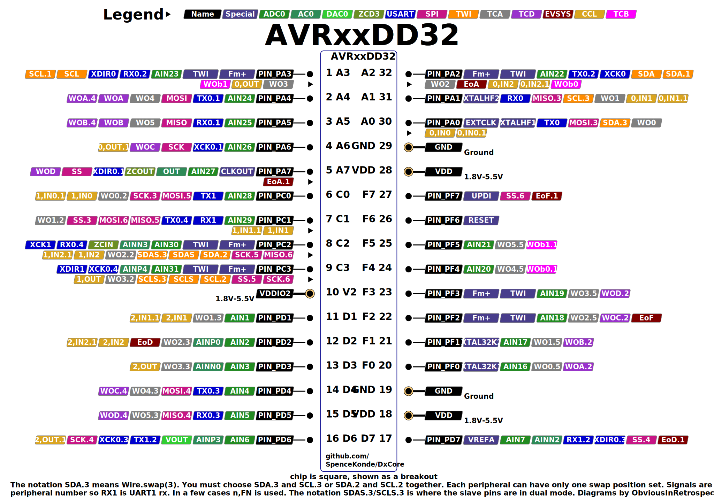

# AVR64DD32/AVR32DD32/AVR16DD32

## Pin Mapping / Pinout
This pinout image is temporary - I know we had the proper square version ready but not what happened to it.

## Features and Peripherals
|                                  | AVR16DD32       | AVR32DD32       | AVR64DD32       |
|----------------------------------|-----------------|-----------------|-----------------|
| Flash Memory                     | 16384           | 32768           | 65536           |
| Flash Memory (with Optiboot)     | 15872           | 32256           | 65024           |
| SRAM                             | 2048            | 4096            | 8192            |
| EEPROM                           | 256             | 256             | 256             |
| User Row                         | 32              | 32              | 32              |
| Max. Frequency (rated, MHz)      | 24              | 24              | 24              |
| Clock Sources                    | INT, EXT, XTAL  | INT, EXT, XTAL  | INT, EXT, XTAL  |
| Packages Available               | TQFP, VQFN      | TQFP, VQFN      | TQFP, VQFN      |
| Total pins on package            | 32              | 32              | 32              |
| I/O Pins (not reset/UPDI)        | 25              | 25              | 25              |
| Fully async pins                 | 27              | 27              | 27              |
| UPDI as I/O Pin                  | Yes             | Yes             | Yes             |
| PWM capable I/O pins             | 23              | 23              | 23              |
| Max simultaneous PWM outputs     | 11: 6:2:3       | 11: 6:2:3       | 11: 6:2:3       |
| 16-bit Type A Timers - pins ea   | 1: 6/4/5/6      | 1: 6/4/5/6      | 1: 6/4/5/6      |
| 16-bit Type B Timers, (pins)     | 3: 5            | 3: 5            | 3: 5            |
| 12-bit Type D pins               | 10              | 10              | 10              |
| USART (pin mappings)             | 2: 5/2          | 2: 5/2          | 2: 5/2          |
| SPI (pin mappings)               | 1: 5            | 1: 5            | 1: 5            |
| TWI/I2C (pin mappings)           | 1: 3            | 1: 3            | 1: 3            |
| 12-bit ADC input pins            | 18/22           | 18/22           | 18/22           |
| Of those, neg. diff. inputs      | all             | all             | all             |
| 10-bit DAC                       | 1               | 1               | 1               |
| Analog Comparator (AC)           | 1               | 1               | 1               |
| Zero-Cross Detectors (ZCD)       | 1               | 1               | 1               |
| Custom Logic Blocks (LUTs)       | 4               | 4               | 4               |
| Event System channels (out pins) | 6 (7)           | 6 (7)           | 6 (7)           |
| On-chip opamps (OPAMP)           | None            | None            | None            |
| MVIO, pins                       | Yes, 4          | Yes, 4          | Yes, 4          |
| Flash Endurance                  | 1k `*`          | 1k `*`          | 1k `*`          |
| LED_BUILTIN (and optiboot led)   | PIN_PA7         | PIN_PA7         | PIN_PA7         |

* VQFN is 5mm x 5mm 0.5mm pitch
* TQFP is 7mm x 7mm 0.8mm pitch

`*` As with all Dx-series, the flash didn't live up to expectations at extreme conditions. 1k is the worst case rating though, and under typical conditions, it is believed that the endurance is >= 10k cycles. I do not know how far along Microchip is in developing a solution, but it's being treated as datasheet clarification, so that's not encouraging. I am hoping for additional information on how flash endurance is influenced by various factors.

## AVR DD32 - Povery model DB without the opamps and fewer peripherals, but with a bunch of errata fixes and added port mappings

That basically sums up the DD28 and DD32 parts. They're much cheaper than DB-series, barely above ATtiny parts, but come with most of the full suite of features. Obviously some things were cut versus the DB - they still come in three sizes, but the sizes have half the flash. There is only 1 analog comparator and no USART2, and we're down to just one SPI and I2C peripheral. On the other hand, the pin multipleximg options of USART0 and SPI0 have gotten luxury treatment. Note also that the alternate pin mapping numbers don't start at 1.

The 4 pins that the 32-pin parts pick up versus the 28-pin parts are PF2-5 - not very exciting for the big-three serial interfaces, but wonderful for PWM, as those largely unpopulated pins on PORTF are perfect for TCA0.

### Fully async pins
All pins on the DDs are supposedly fully async, instead of just pins 2 and 6 within each port. Whether this is actually a good thing or not can be debated.

### USART0 mux options
(options for which no pins are available are not listed, and options missing critical pins or which are strictly worse than another pinset are ~structhrough~)

| USART0  |  TX |  RX | XDIR | XCK |
|---------|-----|-----|------|-----|
| DEFAULT | PA0 | PA1 |  PA2 | PA3 |
| ALT1    | PA4 | PA5 |  PA6 | PA7 |
| ALT2    | PA2 | PA3 |   -  |  -  |
| ALT3    | PD4 | PD5 |  PD6 | PD7 |
| ALT4    | PC1 | PC2 |  PC3 |  -  |

### USART1 mux options
| USART1  |  TX |  RX | XDIR | XCK |
|---------|-----|-----|------|-----|
| DEFAULT | PC0 | PC1 |  PC2 | PC3 |
| ALT2    | PD6 | PD7 |   -  |  -  |

### SPI0 mux options
| SPI0    | MOSI | MISO | SCK |  SS |
|---------|------|------|-----|-----|
| DEFAULT |  PA4 |  PA5 | PA6 | PA7 |
| ALT3    |  PA0 |  PA1 | PC0 | PC1 |
| ALT4    |  PD4 |  PD5 | PD6 | PD7 |
| ALT5    |  PC0 |  PC1 | PC2 | PC3 |
| ALT6    |  PC1 |  PC2 | PC3 | PF7 |

### TWI0 mux options
| Mapping | swap | Master or Slave   | Dual Mode Slave   |
|---------|------|-------------------|-------------------|
| DEFAULT | 0    | SDA/PA2 SCL/PA3   | SDA/PC2 SCL/PC3   |
| ~ALT1~  | ~1~  | ~SDA/PA2 SCL/PA3~ | ~SDA/PC6 SCL/PC7~ |
| ALT2    | 2    | SDA/PC2 SCL/PC3   | ~SDA/PC6 SCL/PC7~ |
| ALT3    | 3    | SDA/PA0 SCL/PA1   | SDA/PC2 SCL/PC3   |

Note that this means that you want Wire.swap(0, 2, or 3, but not 1).

### PWM Pins
Finally, at 32 pins, we see some action in the PWM pins.
* TCA0 can get its full suite of pins on either PORTA or PORTF. With other peripherals occupying pins on PORTA, we use PORTF by default.
* TCD0 again makes sense on DEFAULT or ALT4 (ALT2 not being used unless TCA is moved elsewhere).
* All TCBs can PWM - though the alt pins overlap with those of TCA0, and one is usually used for millis; if a TCB is used for millis timekeeping, it can't be used for PWM.
* This means by default, PF0-5, PA6-7, and PA2-3 will be available for PWM. Changing the millis timer can get you PWM on PC0, at a cost of less efficient millis timekeeping (using TCA0), or the loss of PWM on PA2 or 3.

#### TCA0 mux options
The Type A timers (TCA0) can be mapped to different pins as a group only, and analogWrite() is PORTMUX-aware - you can set TCA0 to output on any port's pin 0-5. Using this feature is easy - you simply write to the portmux register `PORTMUX.TCAROUTEA = (TCA0 pinset)` and then analogWrite() normally. TCA0 pinset is the port number (0-5 for ports A-F), or one of the named constants of the form: PORTMUX_TCA0_PORTx_gc where x is A, C, D or F.

| TCA0    | WO0 | WO1 | WO2 | WO3 | WO4 | WO5 |
|---------|-----|-----|-----|-----|-----|-----|
| PORTA   | PA0 | PA1 | PA2 | PA3 | PA4 | PA5 |
| PORTC   |  -  | PC1 | PC2 | PC3 |  -  |  -  |
| PORTD   |  -  | PD1 | PD2 | PD3 | PD4 | PD5 |
| **PORTF** | **PF0** | **PF1** | **PF2** | **PF3** | **PF4** | **PF5** |

It is strongly recommended to not have any PWM output enabled involving either the timer being moved nor the pins it is being moved to when setting `PORTMUX.TCAROUTEA`. In the latter case, you will not be able to turn off the existing PWM through the API functions. Simple assignment can and should be used to write to the PORTMUX.TCAROUTEA register. This is the only bitfield there, so you needn't worry about stomping on anything else.

Note that the core configures PORTF for PWM, mainly because PORTF isn't very useful, having few aternate functions. The hardware like everything defaults to PORTA.

#### TCB mux options
| TCBn | Default | Alt |
|------|---------|-----|
| TCB0 | **PA2** | PF4 |
| TCB1 | **PA3** | PF5 |
| TCB2 | **PC0** |  -  |

Default mappings are used, since PF4/5 are shared with the preferred TCA pins, which take priority. These are NOT PORTMUX-aware. Only the **bold** pin can be used without modifying or creating a new variant file.

The type B timers are much better utility timers than PWM timers. TCB2 is the default millis timer and cannot be used for PWM in that mode.

#### TCD0 mux options
| TCD0    | WOA | WOB | WOC | WOD |
|---------|-----|-----|-----|-----|
| **DEFAULT** | **PA4** | **PA5** | **PA6** | **PA7** |
| ALT2    | PF0 | PF1 | PF2 | PF3 |
| ALT4    | PA4 | PA5 | PD4 | PD5 |

Like TCA, in 1.5.0 of DxCore, if you set the TCD portmux (`PORTMUX.TCDROUTEA`), digitalWrite() and analogWrite() will be aware of it (digitalWriteFast is never aware of PWM, don't try to use it to shut off PWM, it won't - turning off PWM is most of the overhead we're getting rid of with digitalWriteFast()!).

TCA is used in preference to TCD when both are available on one pin with a given mux setting. Since default is usable, ALT2 overlaps with the clear winner for TCA, and ALT4 uses the two more useful of these 4 pins or the 3rd and 4th most useful non-MVIO pins - PD was a wasteland on the DA, analog stuff only on the DB, but now it's a hub of communication.

### LED_BUILTIN
To match other parts, `PIN_PA7` shall be the pin that the core "expects" to be connected to an LED. If you want to have a different pin be recognized by the application (this does not change the bootloader - you would still need to do a custom build of that too), this can be overridden if a custom board definition is created by passing `-DLED_BUILTIN=(some other pin)` as part of build_extra_flags, building via the CLI, or by equivalent means provided by other third party development environments.

## Official Documentation
When all else fails, read the real documentation. They keep moving the .pdf files around, so now I just link to the prduct page, from whence the datasheet, errata, and "technical briefs" are linked.

**Datasheets and errata change. You can sign up to get emails about such changes through the Microchip PCN system; if you don't, be sure to always use the latest version of the datasheet and especially the errata**

* [AVR64DD32 product page](https://www.microchip.com/en-us/product/AVR64DD32)
* [AVR32DD32 product page](https://www.microchip.com/en-us/product/AVR32DD32)
* [AVR16DD32 product page](https://www.microchip.com/en-us/product/AVR16DD32)

At a minimum, everyone using a modern AVR should plan on having a PDF viewer open with the datasheet, and a text editor with a good search function and the ioavr______.h file open so that when you're trying to use a constant, but the compiler says it isn't declared/defined, you can search the io header for a key phrase in the constant and figure out how it was spelled/formatted or copy/paste it to your sketch. (see [the IO headers](./ioheaders) for more information and links to them. I also keep the AVR instruction set manual open in the PDF viewer as well as the silicon errata and datasheet clarification. Datasheet clarifications are a bigger deal than an erratum, usually. An erratum says "Okay, this doesn't work, but it will some day, maybe" while a datasheet clarification says "This would be an errata, but we're not even going to pretend that we'll fix it some day". But watch out - datasheet clarifications vanish from the list once the datasheet has been updated!

The "Technical Briefs" are [somewhat inconsistent](https://github.com/SpenceKonde/AVR-Guidance/blob/master/TechnicalBriefs.md) in their value, but some are quite good.
