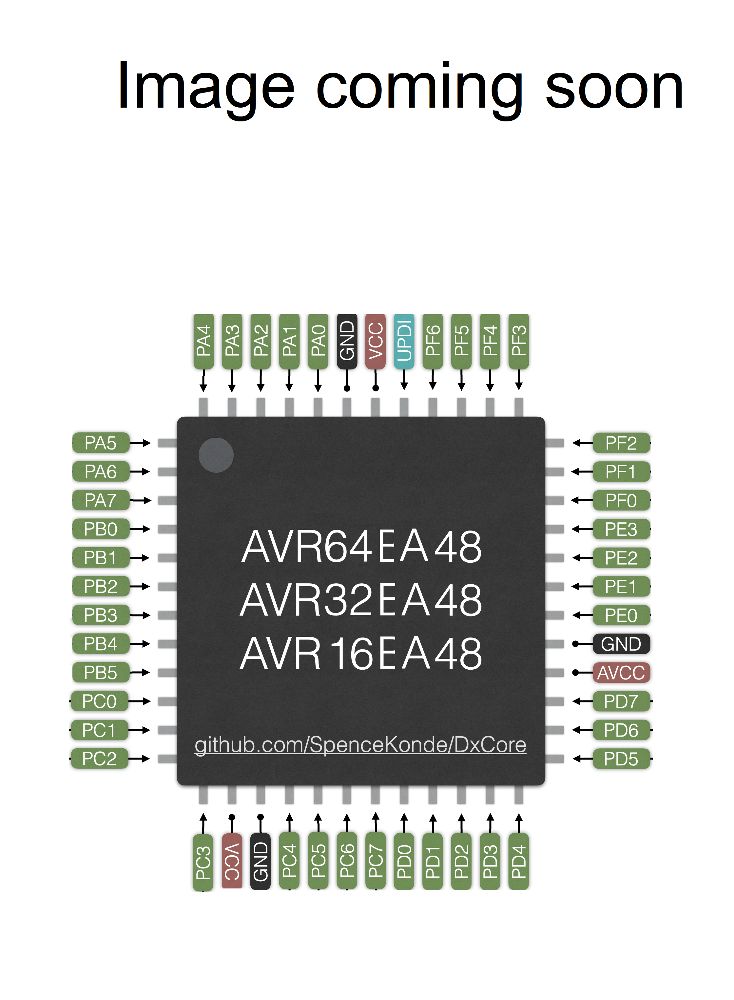

# AVR128EA48/AVR64EA48/AVR32EA48
## Pin Mapping / Pinout


## Features and Peripherals
| -                                | AVRxxEA48                      |
|----------------------------------|--------------------------------|
| Flash Memory                     | 16384, 32768, or 65536         |
| Flash Memory (With Optiboot)     | 15872, 32212, or 65024         |
| SRAM                             | 2048, 4096, 6144               |
| EEPROM                           | 512                            |
| User Row                         | 64                             |
| Max. Frequency (rated, MHz)      | 20                             |
| Clock Sources                    | INT, EXT, XTAL                 |
| Packages Available               | TQFP (9x9mm 0.5p), VQFN (7x7mm 0.4p)                    |
| Total pins on package            | 48                             |
| I/O Pins (not reset/UPDI)        | 40                             |
| Fully async pins                 | 42                             |
| UPDI as I/O Pin                  | Yes                            |
| PWM capable I/O pins             | 28                             |
| Max simultaneous PWM outputs     | 16                             |
| 16-bit Type A Timers - pins ea   | 2: 20 / 12                     |
| 16-bit Type B Timers, (pins)     | 4: 8                           |
| 12-bit Type D pins               | None - no TCD                  |
| USART (pin mappings)             | 3: 5 / 3 / 2                   |
| SPI (pin mappings)               | 1: 6                           |
| TWI/I2C (pin mappings)           | 1: 4                           |
| 12-bit dif ADC w/PGA input pins  | 28                             |
| Of those, neg. diff. inputs      | 28                             |
| 10-bit DAC                       | 1                              |
| Analog Comparator (AC)           | 2                              |
| Zero-Cross Detectors (ZCD)       | None                           |
| Custom Logic Blocks (LUTs)       | 4 :                            |
| Event System channels (out pins) | 6 : 7                          |
| On-chip opamps (OPAMP)           | 3                              |
| MVIO, pins                       | None                           |
| Flash Endurance                  | 1k? 10k? Not sure              |
| LED_BUILTIN (and optiboot led)   | PIN_PA7                        |

## EA48 - Top end pincount for the first of the new Ex-series. This is definitely the pincount where the EA really starts to get interetsting

### The big changes
* Has the new true differential ADC with 1-16x PGA and all the goodies that come with that.
* We got F'ed in the A on the internal oscillator. Not only did we get tinyAVR's oscillator... We kept the crapola calibration of the Dx-series. So the only overclocking we'll see here requires a crystal. Way to hide the AVR's light under a bushel (though I suspect we also got the tinyAVR style core, which would barf by 34MHz, but probable be okay at 32. (which also happens tobethe highest value you can satisfy it's TIMEBASE register for), as opposed to the DX core, which I've clocked as high as 48 MHz!)

### Fully async pins
All pins on the EA-series are "fully async" and can respond to events shorter than 1 clock cycle, and can wake the chip on RISING or FALLING edges, not just LOW_LEVEL and CHANGE.

### USART Mux options

#### USART0 mux options
USART0 retains the portmux emporium he gained with the DD-series. 5 mux options!
| All     |  TX |  RX | XDIR | XCK |
|---------|-----|-----|------|-----|
| DEFAULT | PA0 | PA1 |  PA2 | PA3 |
| ALT1    | PA4 | PA5 |  PA6 | PA7 |
| ALT2    | PA2 | PA3 |   -  |  -  |
| ALT3    | PD4 | PD5 |  PD6 | PD7 |
| ALT4    | PC1 | PC2 |  PC3 |  -  |
| NONE    |  -  |  -  |   -  |  -  |
:

#### USART1 mux options
Likewise, USART1 retains the new mapping it got
| All     |  TX |  RX | XDIR | XCK |
|---------|-----|-----|------|-----|
| DEFAULT | PC0 | PC1 |  PC2 | PC3 |
| ALT1    | PC4 | PC5 |  PC6 | PC7 |
| ALT2    | PD6 | PD7 |   -  |  -  |
| NONE    |  -  |  -  |   -  |  -  |

#### USART2 mux options
| All     |  TX |  RX | XDIR | XCK |
|---------|-----|-----|------|-----|
| DEFAULT | PF0 | PF1 |  PF2 | PF3 |
| ALT1    | PF4 | PF5 |   -  |  -  |
| NONE    |  -  |  -  |   -  |  -  |
USART2 missed the Port Mixer Party for the DD's, and the EA didn't hold any such event so USART2 was left with the same 1.5 mux options as always.


### SPI  mux options
| SPI          | MOSI | MISO | SCK |  SS |
|--------------|------|------|-----|-----|
| SPI0 DEFAULT |  PA4 |  PA5 | PA6 | PA7 |
| SPI0 ALT1    |  PE0 |  PE1 | PE2 | PE3 |
| SPI0 ALT3    |  PA0 |  PA1 | PC0 | PC1 |
| SPI0 ALT4    |  PD4 |  PD5 | PD6 | PD7 |
| SPI0 ALT5    |  PC0 |  PC1 | PC2 | PC3 |
| SPI0 ALT6    |  PC1 |  PC2 | PC3 | PF7 |
| NONE         |   -  |   -  |  -  |  -  |

SPI1, who hit the jackpot in the DD series has held onto his wealth of portmux options, is back with the same options as the DD's had.(see [The SPI.h library documentation](../libraries/SPI/README.md) for details).

### TWI0 mux options
| Mapping | swap | Master or Slave | Dual Mode Slave |
|---------|------|-----------------|-----------------|
| DEFAULT | 0    | SDA/PA2 SCL/PA3 | SDA/PC2 SCL/PC3 |
| ALT1    | 1    | SDA/PA2 SCL/PA3 | SDA/PC6 SCL/PC6 |
| ALT2    | 2    | SDA/PC2 SCL/PC3 | SDA/PC7 SCL/PC7 |
| ALT3    | 3    | SDA/PA0 SCL/PA1 | SDA/PC2 SCL/PC3 |
TWI0 missed out on most of the Portmux Punch, but still managed to gain a single mux option for the DD's and hold onto it.

### PWM Pins
There's no TCD, but with two TCA's and 4 TCBs to back them up, you've still got a respectable 16 maximum independand outputs. TCA1 gained a few new mux options, but only 3-pin ones - but ion the 48-pin parts finally, it can use its' single 6pin mapping!

#### TCA mux options
The Type A timers (TCA0 and TCA1) can be mapped to different pins as a group only, and analogWrite() is PORTMUX-aware - you can set TCA0 to output on any port's pin 0-5, and TCA1 to PORTB. Using this feature is easy - but not quite as trivial as other parts, since there are two bitfields. You simply write to the portmux register `PORTMUX.TCAROUTEA = (TCA1 pinset) | (TCA0 pinset)` and then analogWrite() normally. TCA0 pinset is the port number (0-5 for ports A-F), TCA1 pinsets are from the table below, with numeric values of 0x00 and 0x08 (0-1 << 3; It is recommended to use the named constants however, as shown in the example). The EA48 parts have only two mux options.
| TCA0    | WO0 | WO1 | WO2 | WO3 | WO4 | WO5 |
|---------|-----|-----|-----|-----|-----|-----|
| PORTA   | PA0 | PA1 | PA2 | PA3 | PA4 | PA5 |
| PORTB   | PB0 | PB1 | PB2 | PB3 | PB4 | PB5 |
| **PORTC** | **PC0** | **PC1** | **PC2** | **PC3** | **PC4** | **PC5** |
| PORTD   | PD0 | PD1 | PD2 | PD3 | PD4 | PD5 |
| PORTE   | PE0 | PE1 | PE2 | PE3 |  -  |  -  |
| PORTF   | PF0 | PF1 | PF2 | PF3 | PF4 | PF5 |

| TCA1    | WO0 | WO1 | WO2 | WO3 | WO4 | WO5 |
|---------|-----|-----|-----|-----|-----|-----|
| **PORTB** | **PB0** | **PB1** | **PB2** | **PB3** | **PB4** | **PB5** |
| PORTC   | PC4 | PC5 | PC6 |  -  |  -  |  -  |
| PORTA   | PA4 | PA5 | PA6 |  -  |  -  |  -  |
| PORTD   | PD5 | PD5 | PD6 |  -  |  -  |  -  |

```c
// Simple Assignment:
PORTMUX.TCAROUTEA = PORTMUX_TCA0_PORTF_gc | PORTMUX_TCA1_PORTB_gc; // PWM on PORTF and PORTB pins 0-5

// one-liner, set TCA0 PORTD (not as readily generalizable):
PORTMUX.TCAROUTEA = (PORTMUX.TCAROUTEA & PORTMUX_TCA1_gm) | PORTMUX_TCA0_PORTD_gc; // Move TCA0 PWM to PORTD but don't change TCA1 PWM
// The first option is slightly faster, as it isn't a read-modify-write. You almost always want TCA1 mux to be set to PORTB.
// Note that PORTMUX_TCA0_PORTA_gc and PORTMUX_TCA1_PORTB_gc have a numeric value of 0. So for the common case, you can use simple assignment to set
// PORTMUX.TCAROUTEA to PA, PB, PC, PD, PE, or PF

// Maximally generalizable method (for any multi-bit bitfield w/in a a register):
uint8_t tcaroutea = PORTMUX.TCAROUTEA;  // Registers are volatile variables, so load it to temporary variable to change it in multiple steps
tcaroutea &= ~PORTMUX_TCA0_gm;          // mask off the bits we will change. This method (copy to local var, &= ~THIS_BITFIELD_gm, |= THIS_GROUPCODE_gc ) generalizes better
tcaroutea |= PORTMUX_TCA0_PORTx_gc;     // and then set them to their new value.
PORTMUX.TCAROUTEA = tcaroutea; //since the  then write the temp variable back to the register.

// The above constructions will both give 7 clocks and 6 words and the compiler output identical - lds, andi, ori, sts (while the simple assignment would optimize down to only 3 words, 3 clocks (ldi, sts)).

// In contrast, the naive method:
PORTMUX.TCAROUTEA &= ~PORTMUX_TCA0_gm;
PORTMUX.TCAROUTEA |= PORTMUX_TCA0_PORTx_gc;
// takes 12 clocks/10 words - t has to load the value, modify, and store it, and then reload it, make the second modification, and store it again.
```

#### TCB mux options
| TCBn | Default |  Alt  |
|------|---------|-------|
| TCB0 |    PA2  | **PF4** |
| TCB1 |    PA3  | **PF5** |
| TCB2 | **PC0** |  PB4  |
| TCB3 |    PB5  | **PC1** |

These are NOT PORTMUX-aware. Only the **bold** pin can be used without modifying or creating a new variant file.

The type B timers are much better utility timers than PWM timers. TCB2 is the default millis timer and cannot be used for PWM in that mode.

### LED_BUILTIN
Following precedent set by MegaCoreX, we declare that pin 7 - `PIN_PA7` shall be the pin that the core "expects" to be connected to an LED. LED_BUILTIN is defined as that pin, and the bootloader will set that pin as output and try to blink the LED. Note that if the bootloader is not used, and your sketch does not reference `LED_BUILTIN` this pin is not otherwise treated any differently. This can be overridden if a custom board definition is created by passing `-DLED_BUILTIN = (some other pin)` in the `build.extra_flags` field.

### Reset pin can be input
Reset (PF6) can be set to work as an input (but never an output). The UPDI pin (PF7) can be used as an I/O pin. but in this case HV UPDI is needed to reprogram.
### ADC pins in differential mode
Only pins on PORTD and PORTE can be used as the negative side of a differential analog reading (`analogReadDiff()`). Pins on PORTF can be used as positive or single ended ADC inputs only.

## Official Documentation
When all else fails, read the real documentation. They keep moving the .pdf files around, so now I just link to the prduct page, from whence the datasheet, errata, and "technical briefs".

**Datasheets and errata change. You can sign up to get emails about such changes through the Microchip PCN system; if you don't, be sure to always use the latest version of the datasheet and especially the errata**

* [AVR64EA48 product page](https://www.microchip.com/en-us/product/AVR64EA48)
* [AVR32EA48 product page](https://www.microchip.com/en-us/product/AVR32EA48)
* [AVR16EA48 product page](https://www.microchip.com/en-us/product/AVR16EA48)

At a minimum, everyone using a modern AVR should plan on having a PDF viewer open with the datasheet, and a text editor with a good search function and the ioavr______.h file open so that when you're trying to use a constant, but the compiler says it isn't declared/defined, you can search the io header for a key phrase in the constant and figure out how it was spelled/formatted or copy/paste it to your sketch. (see [the IO headers](./ioheaders) for more information and links to them. I also keep the AVR instruction set manual open in the PDF viewer as well as the silicon errata and datasheet clarification. Datasheet clarifications are a bigger deal than an erratum, usually. An erratum says "Okay, this doesn't work, but it will some day, maybe" while a datasheet clarification says either "This would be an errata, but we're not even going to pretend that we'll fix it some day" or occasionally "there is poor communication between the engineering and documentation departments".

### Technical briefs
Technical briefs are what Microchip calls the sort of documents that most of the industry refers to as "app notes". Technical brief is an apt term, as it covers the wide range of usefulness and detail that can be seen in the technical briefs: Some of these are briefs as in a briefing, like what would be given to a military commander for making strategic decisions, and are highly useful. Other "technical briefs" are simply "brief", that is, short. This is not always bad, but sometimes a technical brief ends up FAR too brief and covers a topic that deserves considerably more discussion (the "product brief" is the extreme of this - in the past what is now called a "product brief" may have been called a "datasheet summary". There are also nn unfortunate few of the "technical briefs" that are even less helpful. Here the name is still apt, but in this case, it's in the sense of the article of clothing of that name: they cover the ass ("Yeah, we have a technical brief explaining that functionality"), but achieve little more. While they may be a starting point, you'd need a lot more to go anywhere. One gets the impression that the tech briefs are sometimes written by people who really know how the feature works at a very deep level, resulting in useful informative documents, others are written somewhat more abstractly, as if the writer has understanding, but little realworld experience, and in the worst tech briefs, it seems to have been written by someone who has no actual eperience using the features, and are going completely from the datasheet and maybe a scrawled set of notes from engineering - but are writing with precious little understanding.

A fair portion of tech briefs are essentially useless - but there are also some really insightful and solid ones that are of great utility. They cannot be distinguished without reading them, but once you start reading, you very rapidly will realize which kind you have.
